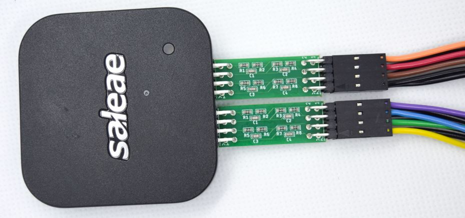

# Community Created Accessories

Several Logic accessories have been made available by our community of users. These are listed below. If you've created an accessory that you'd like to share, [let us know](https://contact.saleae.com/hc/en-us/requests/new)!

### 10:1 Attenuator

* Product Page: [http://www.hunterembedded.co.uk/products/](http://www.hunterembedded.co.uk/products/)
* Description: The attenuator plugs in between the Logic device and the probes and is shaped to allow multiple ones to be used together. It provides attenuation with Low Frequency compensation on 4 channels.

### Logic Pro 16 Analyzer Dock Station

* by [earlynerd](https://www.thingiverse.com/earlynerd/about)
* Thingiverse Download: [https://www.thingiverse.com/thing:3112823](https://www.thingiverse.com/thing:3112823)

### Logic Holder

* by [PCBGRIP](https://www.thingiverse.com/PCBGRIP/about)
* Thingiverse Download: [https://www.thingiverse.com/thing:735911](https://www.thingiverse.com/thing:735911)

### Logic Pro 16 Desktop Organizer

* by [BuildXYZ](https://www.thingiverse.com/buildxyz/about)
* Thingiverse Download: [https://www.thingiverse.com/thing:3473347](https://www.thingiverse.com/thing:3473347)

### Saleae Tower-of-Hanoi Organizer

* by Helmut Lord
* Printables Download: [https://www.printables.com/model/860963-saleae-tower-of-hanoi-organizer](https://www.printables.com/model/860963-saleae-tower-of-hanoi-organizer)

