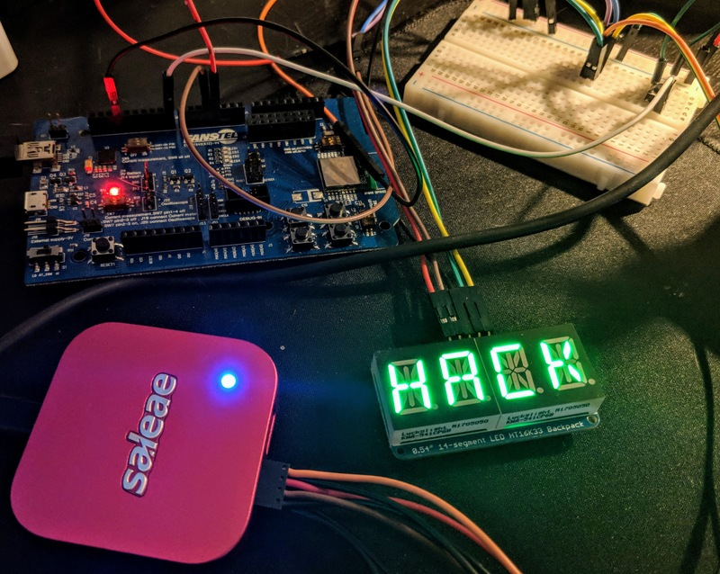

# Extensions

Extensions are Python modules that enhance the debugging process by providing powerful analysis tools on top of your data. You can build start building an extension in the [Logic 2.x software](https://ideas.saleae.com/f/changelog/) in a few minutes and share it with others, or use one of the community extensions via the Marketplace. There are currently three types of extensions: **High-Level Analyzers, Analog measurements, and Digital Measurements.**

We couldn't be more excited to announce this feature!

### High Level Analyzers

High level analyzers are protocol analyzers that process the output of the existing "low level" analyzers already in the app. You can write your own in Python. This lets you create powerful new analyzers without needing to reinvent the wheel. So far, our favorite application of high level analyzers is converting existing decoded I2C bytes into clean, decoded messages specific to the I2C device we're working with, to easily read recorded I2C traffic without needing to go back to the datasheet.



### Digital and Analog Measurements

Digital and analog measurement extensions let you write python code that processes a selected range of analog or digital data, and produces metrics. For example, if you would like to calculate the jitter in a digital clock recording, You can simply write a python script which iterates over the transitions in the selected range, and computes the deviation from nominal. Once written, just shift+click a region of a digital channel, and your measurement result will appear in the list with the other measurements!



### Marketplace

Released in 2.3.0, the marketplace allows you to browse community written extensions and install them. You can also publish your own! Over time, we'll be able to build up a collection of extensions. We can't wait to see what kinds of extensions will be shared there.

To browse the extension marketplace, install the latest Logic software, and click the extensions button on the sidebar.



### Getting Started

Looking to get started?

Check out the Python High Level Analyzer quick start guide here!



Check out the Python Measurement quick start guide here!



### Documentation

Looking to learn more about extensions? Take a look at the sections below for more information.









