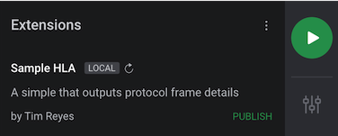
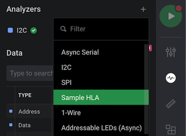

# Extensions Quickstart

In this guide, we will show you how to quickly create an extension and publish it to the Saleae Marketplace for others to use. We will create an HLA \(High Level Analyzer\) extension. Currently, HLAs are supported for the Async Serial, I2C, and SPI protocol analyzers. We plan to add support for more protocol analyzers in future revisions of the [Logic 2.x software](https://ideas.saleae.com/f/changelog/).


Publishing an extension is not yet available in the latest Logic 2.x software. We will update this notice and this guide once it's ready. Note that publishing your extension will make it installable for anyone who uses the Logic software.


1. Click the 'Extensions' panel button on the right of the software
2. Click 'Create Extension'
3. Under 'Generate from template', choose the type of extension you would like to create. For this example, we will create a High Level Analyzer.
4. Click 'Additional Information' to fill in information about your extension.

5. Click 'Save As...' to save and select your location.  
6. You should now see your new extension listed as 'Local' in the software.

7. To test the new Sample HLA, capture any Async Serial, I2C, or SPI data and add the appropriate protocol analyzer. We've provided an I2C capture below in case you don't have a protocol data recording available.



8. Click the Analyzers '+' button to add our Sample HLA. 

9. In the settings popup, select 'I2C' under Input Analyzer. For the rest of the settings, you can leave them as default and click 'Finish'. Once you add the HLA, you can see it as a virtual channel as shown in the image below.

10. To edit the Sample HLA \(perhaps as a starting point to creating your own HLA\), you can click the 'Local' button next to 'Sample HLA' under the Extensions panel. This will open the containing folder for your extension files which you can update for your needs. In this guide, we will leave this HLA as is and publish it to the marketplace.

11. Once your extension is ready, click 'Publish.'

