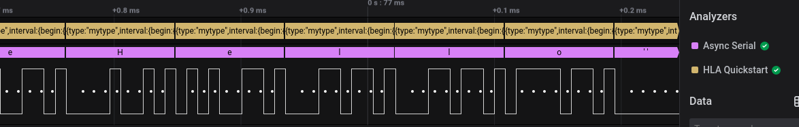
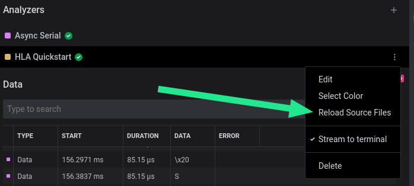
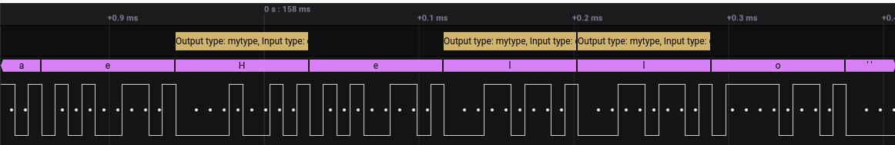
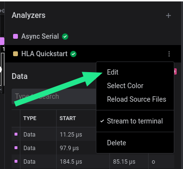
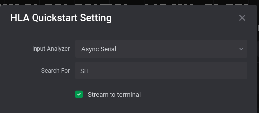
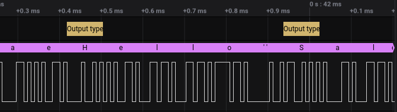
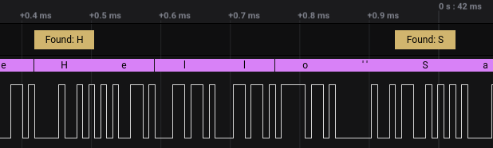
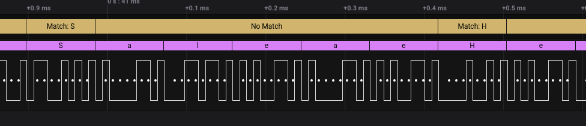

# High-Level Analyzer Extensions


This guide assumes that you have familiarity with the [Python](https://www.python.org/) programming language. It is what will be used to customize our HLA.


## Overview

This guide assumes [you have generated](extensions-quickstart.md) a new High-Level Analyzer. In this guide you will learn about:

1. The files included in the HLA template extension and what they are.
2. The different parts of `HighLevelAnalyzer.py`.
3. How to process input analyzer frames and output new analyzer frames.

## High Level Analyzer Files

In your new High Level Analyzer \(HLA\) extension folder you will find 3 files:

* `README.md`
  * Documentation for your extension, shown within Logic 2 when you select an extension, and what users will see if you put your extension on the Marketplace.
* `extension.json`
  * Every extension must have this file in its root directory.
  * Contains metadata about the extension, and the HLAs and Measurement scripts that are included with the extension.
* `HighLevelAnalyzer.py`
  * Python source code for your HLA.

For the purposes of this document, we will be focusing on `HighLevelAnalyzer.py`

## HighLevelAnalyzer.py Breakdown

Let's break down the contents of `HighLevelAnalyzer.py` .


```python
from saleae.analyzers import HighLevelAnalyzer, AnalyzerFrame, StringSetting, NumberSetting, ChoicesSetting

class MyHla(HighLevelAnalyzer):
    
    # Settings:
    my_string_setting = StringSetting()
    my_number_setting = NumberSetting(min_value=0, max_value=100)
    my_choices_setting = ChoicesSetting(['A', 'B'])
    
    # Output formats
    result_types = {
        'mytype': {
            'format': 'Output type: {{type}}, Input type: {{data.input_type}}'
        }
    }
    
    # Initialization
    def __init__(self):
        print("Settings:", self.my_string_setting,
              self.my_number_setting, self.my_choices_setting)
    
    # Data Processing
    def decode(self, frame: AnalyzerFrame):
        return AnalyzerFrame('mytype', frame.start_time, frame.end_time, {
            'input_type': frame.type
        })
```


#### Imports

```python
from saleae.analyzers import HighLevelAnalyzer, AnalyzerFrame, StringSetting, NumberSetting, ChoicesSetting
```

#### Declaration and Settings

All HLAs must subclass [HighLevelAnalyzer](api-documentation.md#class-saleae-analyzers-highlevelanalyzer), and additionally output [AnalyzerFrames](api-documentation.md#class-saleae-analyzers-analyzerframe-type-str-start_time-saleae-data-timing-graphtime-end_time-saleae-data-timing-graphtime-data-dict-none). The `Setting` classes are included so we can specify settings options within the Logic 2 UI.

```python
class MyHla(HighLevelAnalyzer):
    my_string_setting = StringSetting(label='My String')
    my_number_setting = NumberSetting(label='My Number', min_value=0, max_value=100)
    my_choices_setting = ChoicesSetting(label='My Choice', ['A', 'B'])
```

This declares our new HLA class, which extends from HighLevelAnalyzer, and 3 settings options that will be shown within the Logic 2 UI.

#### Output formats

```python
    result_types = {
        'mytype': {
            'format': 'Output type: {{type}}, Input type: {{data.input_type}}'
        }
    }
```

This specifies how we want output AnalyzerFrames to be displayed within the Logic 2 UI. We will come back to this later.

#### Initialization

```python
    def __init__(self):
        print("Settings:", self.my_string_setting,
              self.my_number_setting, self.my_choices_setting)
```

This is called when your HLA is first created, before processing begins. The values for the settings options declared at the top of this class will be available as instance variables here. In this case, the settings values will be printed out and visible within the Logic 2 terminal view.

#### Data Processing

```python
    def decode(self, frame: AnalyzerFrame):
        return AnalyzerFrame('mytype', frame.start_time, frame.end_time, {
            'input_type': frame.type
        })
```

This is where the bulk of the work will be done. This function is called every time the input to this HLA produces a new frame. It is also where we can return and output new frames, to be displayed within the Logic 2 UI. In this case we are outputting a new frame of type `'mytype'`, which spans the same period of time as the input frame, and has 1 data value `'input_type'` that contains the value of the `type` of the input frame.

## Writing an HLA to search for a value

Now that we've gone over the different parts of an HLA, we will be updating our example HLA to search for a value from an Async Serial analyzer.

### Example Data

In the Extensions Quickstart you should have downloaded and opened a capture of i2c data. For this quickstart we will be using a capture of Async Serial data that repeats the message "Hello Saleae".



### Remove Unneeded Code

To start, let's remove most of the code from the example HLA, and replace the settings with a single `search_for` setting, which we will be using later.

```python
from saleae.analyzers import HighLevelAnalyzer, AnalyzerFrame, StringSetting

class MyHla(HighLevelAnalyzer):
    search_for = StringSetting()
    result_types = {
        'mytype': {
            'format': 'Output type: {{type}}, Input type: {{data.input_type}}'
        }
    }
    
    def __init__(self):
        pass
        
    def decode(self, frame: AnalyzerFrame):
        return AnalyzerFrame('mytype', frame.start_time, frame.end_time, {
            'input_type': frame.type
        })
```

If you open the example data from above and add this analyzer, selecting the Async Serial analyzer as input, you should see the following when zooming in:



Our HLA \(top\) is outputting a frame for every frame from the input analyzer \(bottom\), and displaying their types.

### Understanding the Input Frames

The goal is to search for a message within the input analyzer, but first we need to understand what frames the input analyzer \(Async Serial in this case\) produces so we can know what frames will be passed into the `decode(frame:` [`AnalyzerFrame`](api-documentation.md#class-saleae-analyzers-highlevelanalyzer)`)` function.

The frame formats are documented under [Analyzer Frame Types](analyzer-frame-types/), where we can find [Async Serial](analyzer-frame-types/serial-analyzer.md).

The Async Serial output is simple - it only outputs one frame type, `data`, with 2 fields: `data` , `error`, and `address`. The serial data we are looking at will not be configured to produce frames with the `address` field, so we can ignore that.

To recap, the `decode(frame)` function in our HLA will be called once for each frame from the Async Serial analyzer, where:

* `frame.type` will always be `data`
* `frame.data['data']` will be a \`bytes\` object with the data for that frame
* `frame.data['error']` will be set if there was an error

### Updating \`decode\(\)\` to search for "H" or "l"

Now that we we understand the input data, let's update our HLA to search for the character `"H"`.

```python
    def decode(self, frame: AnalyzerFrame):
        # The `data` field only contains one byte
        try:
            ch = frame.data['data'].decode('ascii')
        except:
            # Not an ASCII character
            return

        # If ch is 'H' or 'l', output a frame
        if ch in 'Hl':
            return AnalyzerFrame('mytype', frame.start_time, frame.end_time, {
                'input_type': frame.type
            })
```

After applying the changes, you can open the menu for your HLA and select `Reload Source Files` to reload your HLA:



You should now only see HLA frames where the Async Serial frame is an `H` or `l`:



### Replace the hardcoded search with a setting

Now that we can search for characters, it would be much more flexible to allow the user to choose the characters to search for - this is where our `search_for` setting that we added earlier comes in.

```python
class MyHla(HighLevelAnalyzer):
    search_for = StringSetting()
```

Instead of using the hardcoded `'Hl'`, let's replace that with the value of `search_for`:


```python
# If the character matches the one we are searching for, output a new frame
if ch in self.search_for:
    return AnalyzerFrame('mytype', frame.start_time, frame.end_time, {
        'input_type': frame.type
    })
```


Now if you can specify the characters to search for in your HLA settings:







#### Updating the display string

To update the display string shown in the analyzer bubbles, the `format` string in `result_types` variable will need to be updated. `'mytype'` will also be updated to `'match'` to better represent that the frame represents a matched character.

```python
result_types = {
    'match': {
        'format': 'Found: {{data.char}}'
    }
}
```

And in `decode()`: we need to update the data in `AnalyzerFrame` to include `'char'`, and update the frame `'type'` to `'match'`.

```python
# If the character matches the one we are searching for, output a new frame
if ch in self.search_for:
    return AnalyzerFrame('match', frame.start_time, frame.end_time, {
        'char': ch
    })
```

After reloading your HLA you should see the new display strings:



#### Using time

`AnalyzerFrame`s include a `start_time` and `end_time`. These get passed as the second and third parameter of `AnalyzerFrame`, and can be used to control the time span of a frame. Let's use it to fill in the gaps between the matching frames.

Let's add a `__init__()` to initialize the 2 time variables we will use to track the span of time that doesn't have a match:

```python
def __init__(self):
    self.no_match_start_time = None
    self.no_match_end_time = None

```

And update `decode()` to track these variables:

```python
# If the character matches the one we are searching for, output a new frame
if ch in self.search_for:
    frames = []

    # If we had a region of no matches, output a frame for it
    if self.no_match_start_time is not None and self.no_match_end_time is not None:
        frames.append(AnalyzerFrame(
            'nomatch', self.no_match_start_time, self.no_match_end_time, {}))

        # Reset match start/end variables
        self.no_match_start_time = None
        self.no_match_end_time = None

    frames.append(AnalyzerFrame('match', frame.start_time, frame.end_time, {
        'char': ch
    }))

    return frames
else:
    # This frame doesn't match, so let's track when it began, and when it might end
    if self.no_match_start_time is None:
        self.no_match_start_time = frame.start_time
    self.no_match_end_time = frame.end_time
```

And lastly, add an entry in `result_types` for our new `AnalyzerFrame` type `'nomatch'`:

```python
    result_types = {
        'match': {
            'format': 'Match: {{data.char}}'
        },
        'nomatch': {
            'format': 'No Match'
        }
    }
```

The final output after reloading:



## What's Next?

* Find out about other analyzers and the AnalyzerFrames they output in the [Analyzer Frame Types](analyzer-frame-types/) documentation.
* Use the [API Documentation](api-documentation.md) as a reference.
* Browse the Saleae Marketplace in Logic 2 for more ideas and examples of extensions you can create.

