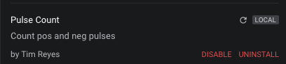

# Measurement Extensions

The software currently has a few built-in measurements already installed and ready to use. The gif below demonstrates how to use them. You can also hold the shift key while dragging across your recorded data to add a measurement without using the sidebar. The use of measurement extensions will allow additional custom measurements to be made. 


### Create an Extension

A measurement extension consists of at least two files, all of which should be stored in the same folder.

* an `extension.json` file, which stores information about the extension
* one or more python source files

To quickly get acquainted with measurement extensions, you can follow along with creating one below. Here, we will walk you through the installation of a custom measurement extension which you can try out immediately.

1. Make sure you're running the latest version of [Logic 2.x software](https://ideas.saleae.com/f/changelog/).  
2. Open the software. Click the 'Extensions button' to open the 'Extensions Panel' and click 'Create Extension.'


3. A pop-up window will appear. Under 'Generate from template', select 'Digital Measurement' and click 'Save As.' We will be creating a Digital Measurement.  
4. Navigate to a location of your choice to save your measurement extension folder. Let's name the folder as 'pulseCount'  
5. Confirm that your new 'pulseCount' folder now contains two files \(`extension.json` & `DigitalMeasurement.py`\).  
6. Rename `DigitalMeasurement.py` to `pulseCount.py` to give it a more relevant name.  
7. For `pulseCount.py`, copy and paste the code from [here](https://github.com/saleae/logic2-extensions-examples/blob/master/pulseCount/pulseCount.py)  
8. For `extension.json`, copy and paste the code from [here](https://github.com/saleae/logic2-extensions-examples/blob/master/pulseCount/extension.json)  
9. Now we will install the extension to the software. Follow the instructions in the Extensions article below, under the section titled "Installing an Extension."



10. You should now see 'Pulse Count' appear in the 'Extensions' panel of the software.



11. To see your new measurement in action, take a capture of digital data and add a measurement to it as shown in the gif at the top of this article. You should see the new measurements:


* Np\(+\) for number of positive pulses
* Np\(-\) for number of negative pulses

### Extension File Layout

Let's take a look at the `extension.json` file for our Pulse Count extension that we recently installed above. There exists some key metadata properties. 

The `author`, `description`, and `name` properties manage what appears in the Extensions panel where the extensions are managed. 

```text
"author": "Tim Reyes",
"description": "Count pos and neg pulses",
"name": "Pulse Count",
```

The `extensions`  section describes more properties specific to your extension. Note that multiple measurements can exist within a single extension. In this example, we include only one called `Pulses`. 

```text
"extensions": {
  "Pulses": {
    "type": "DigitalMeasurement",
    "entryPoint": "pulseCount.PosNegPulseMeasurer",
    "metrics": {
      "positivePulses": {
        "name": "Positive Pulses",
        "notation": "N<sub>p(+)</sub>"
      },
      "negativePulses": {
        "name": "Negative Pulses",
        "notation": "N<sub>p(-)</sub>"
      }
    }
  }
}
```

| Property | Description |
| :--- | :--- |
| `type` | Here we tell the software that this will be a `DigitalMeasurement`. On the other hand, an analog measurement will have the type `AnalogMeasurement` |
| `entryPoint` | Points the software to the measurement's python file and its class name. This line is structured like so: `<python_file_name>.<python_class_name>` |
| `metrics` | Measurements need to compute a set of display values for a specific range of time, over a single digital or analog channel. These display values are called metrics. Each metric needs to be declared here. We've declared two metric keys - `positivePulses` and `negativePulses`. These keys will be passed into your python code, so be sure to keep note of them. |
| `notation` | The notation that appears when the software displays the metric. Can be an html string, however only limited tags are supported: ['b'](https://developer.mozilla.org/en-US/docs/Web/HTML/Element/b), ['i'](https://developer.mozilla.org/en-US/docs/Web/HTML/Element/i), ['em'](https://developer.mozilla.org/en-US/docs/Web/HTML/Element/em), ['strong'](https://developer.mozilla.org/en-US/docs/Web/HTML/Element/strong), ['sub'](https://developer.mozilla.org/en-US/docs/Web/HTML/Element/sub) |
| `units` | This should not include a metric prefix, as this will automatically be calculated. For example, if the unit is frequency, provide "Hz" as a string, and ensure your measurement class always returns a value in "Hz". The Logic software will automatically adjust large or small numbers to display with the correct metric prefix. For example, 1000 Hz will be automatically displayed as 1 kHz. |

### Python File Layout

Digital measurements are implemented with a class template that looks like below. Take a look at [`pulseCount.py`](https://github.com/saleae/logic2-extensions-examples/blob/master/pulseCount/pulseCount.py) to see how this was implemented for our Pulse Count extension.

```text
from saleae.range_measurements import DigitalMeasurer

class MyDigitalMeasurement(DigitalMeasurer):
  # Add supported_measurements here. This includes the metric
  # strings that were defined in the extension.json file.

  def __init__(self, requested_measurements):
    super().__init__(requested_measurements)
    # Initialize your variables here

  def process_data(self, data):
    for t, bitstate in data:
    # Process data here
  
  def measure(self):
    values = {}
    # Assign the final metric results here to the values object
    return values
```

Analog measurements are implemented with a class template that looks like below. Take a look at [`voltage_peak_to_peak.py`](https://github.com/saleae/logic2-extensions-examples/blob/master/voltagePeakToPeak/voltage_peak_to_peak.py) to see how this was implemented for an example analog extension.

```text
from saleae.range_measurements import AnalogMeasurer

class VoltageStatisticsMeasurer(AnalogMeasurer):
  # Add supported_measurements here. This includes the metric
  # strings that were defined in the extension.json file.

  def __init__(self, requested_measurements):
    super().__init__(requested_measurements)
    # Initialize your variables here

  def process_data(self, data):
    # Process data here
  
  def measure(self):
    values = {}
    # Assign the final metric results here to the values object
    return values
```

### Development Process


