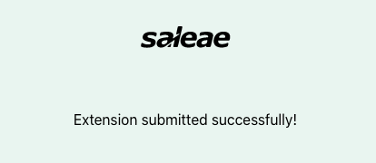
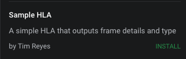

# Publish an Extension

Publishing your extension to the Saleae Marketplace will make it readily available to anyone who uses our software. With your help, we're hoping to provide a growing list of feature extensions that our users can benefit from!

### Prerequisites

Before publishing, you will need to have the following completed.

* You have finished developing your extension and are ready to share it. You can follow along with our Extensions Quickstart guide below as a starting point.



* Your extension must be uploaded to a [GitHub](https://github.com/) repository.
* You must [create a release](https://help.github.com/en/github/administering-a-repository/managing-releases-in-a-repository) for your extension.

You can take a look at an [example GitHub repository](https://github.com/timreyes/sampleHLA) for our Sample HLA, which we will use in the following guide.

### Publishing an Extension

1. Once you've finished developing your extension, click 'Publish' under the Extensions panel for your extension.

2. Clicking 'Publish' should open your browser and load our extensions submission page. Provide your GitHub repository URL here and click 'Submit'.

3. Afterwards, you'll be taken to a new page to authorize Saleae Marketplace to access your GitHub account. 

4. Click 'Authorize' and you should immediately receive an email confirming that your extension has been added to the Marketplace. The web page should also confirm that your extension was submitted successfully.

5. Click the three dots at the top of the Extensions panel and click 'Check for Extension Updates.'

6. Congratulations! If the publish was successful, your extension should now appear in the software like below.

