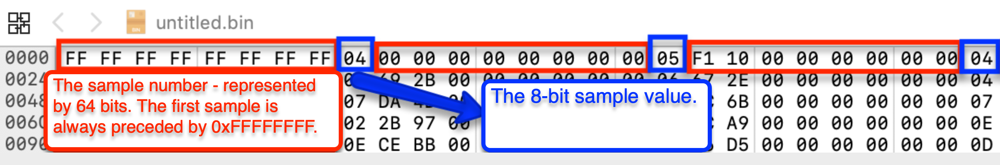

# Binary Data Export Format - Digital Channels

The Binary export option in the Saleae software is used to export the captures signals to a binary file.

The Binary export option can export either digital samples or analog samples but does not support exporting both to the same file.

The Binary exported file is stored LittleEndian, as is standard for x86 platforms.

There are two main options for exporting digital data: \(1\) export every sample and \(2\) export sample numbers where any channel changes state.

Export every sample is the simplest. You also need to select the word size for your export and if missing channels should chase the higher index channels to be downshifted.

The word size needs to be larger than the number of channels exported. For instance, if you choose to export 12 channels, you will need to select at least a 16-bit word size to fit all 12 channels.

Note: Bits where channels are not present will remain 0.

The downshifting option can be a little confusing.

Let's say you are exporting channels 0, 3, 4, 5, and 7 and you are using a 16-bit word size. Without downshifting enabled, that would simply match each bit in the 16-bit word to a channel where unused channels would stay blank, like this: 0b00000000X0XXX00X. Where X contains channel data. 0b--------7-543--0 \(or like this, where "-" is always zero, and a number represents the bitstate of that channel.\) Downshifting will shift channels to fill in any zeros, like so: 0b00000000000XXXXX 0b-----------75430

Then, when exporting every sample, you will end with a binary file that has a size in bytes of \(word size in bytes \* sample count\). There is no header or other data in the file, and it can easily be read by any library that supports reading and writing binary files.

Then, you can export just the sample numbers where one or more of the exported channels change state. You still select the word size and the downshift option, but now every word is preceded by a 64-bit unsigned sample number.

To read this file, simply read a 64-bit number followed by the selected word size in a loop.

The first entry will always be the first sample in the export range and will contain the initial bitstates of all channels. After that, each entry will include the sample number of the first location where the binary state of the inputs changed, along with the new state of all of the inputs \(usually, only 1 input will change at a time, but all states are still included\). You can assume that all samples up to but not including this sample number were identical to the last entry.

### Example

The following Export Format and Binary Settings will produce a binary data export file as shown below.

### What About Analog Data? 

Analog binary analog export does contain a basic header before the data sections. You can find full details on the analog binary export format here:



