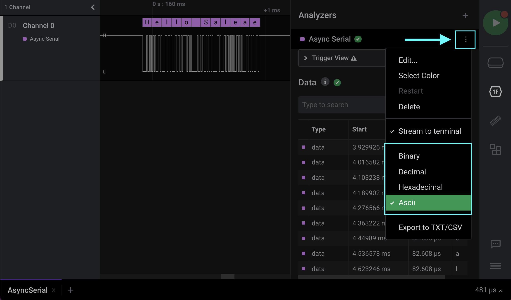

# Changing the Display Radix (Base)

Just about every part of the software that displays a number can display it in a number of display radices. The software supports the following radices:

* Hexadecimal (base 16)
* Decimal (base 10)
* Binary (base 2)
* ASCII (non-displayable characters revert to decimal display, with single quotes)

The display radix can be changed for each individual analyzer added to your capture by clicking the three dots to the right of your analyzer as shown below.

You can also change the display radix by right-clicking on a protocol result above the waveform like in the image below.

<figure><figcaption>
Rick-clicking an analyzer result to change the display radix
</figcaption></figure>

Note that some numbers, such as indexes, might not change radix. This is the case for the DMX-512 analyzer and several other analyzers that use indexes.

## Logic 1.x

If you are using the older Logic 1.x software, you can follow the instructions below.

There is a global display radix setting on the main options menu. By default, this will change all of the analyzers' displays to that radix. The protocol search results always display using the same radix as the analyzers.

Protocol analyzer exporting always uses the same display radix as that analyzer. For instance, if you change the global display radix to Hex, then when you export a serial protocol analyzer, the resulting text file will include Hex numbers.

Raw data export (options -> export data), which does not export data, has its own radix selection. Only some export formats have this option since it only affects CSV exports under certain circumstances.

**Using Multiple Analyzers with Different Display Radices at the Same Time**

By default, all analyzers will use the global display radix set from the main options menu. However, you can override that by changing the analyzer specific display radix from the small settings menu for each analyzer. The analyzer settings menu is selected by clicking the gear icon next to that analyzer on the analyzer's panel. This also controls that analyzer's display radix in the decoded protocols list as well as the export format.

