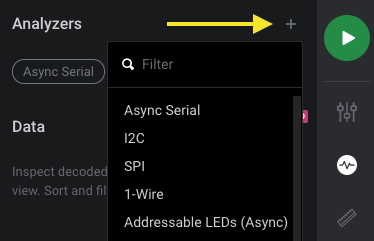

# Installing Custom Protocol Analyzers

## Logic 2.x Instructions

### Windows

To install your custom protocol analyzer, place your analyzer .dll file into the following folder:`C:\Program Files\Logic\resources\windows\Analyzers`

Afterwards, restart the Logic software and you should see your protocol analyzer in the dropdown list by clicking the '+' icon next in the Analyzers panel of the software.

### MacOS and Linux


On [Logic 2.x](https://ideas.saleae.com/f/changelog/), we currently only support installing custom analyzers on Windows. We plan to add MacOS and Linux support soon.


## Logic 1.x Instructions

These instructions show how to set up the Saleae software to load custom protocol analyzers.

* First, open the Options menu and select Preferences.

* Navigate to the Developer tab and click Browse in the "Search this path..." section.

* Browse to the location where the .dll, .so, or .dylib analyzer library is stored. 
* Click "Select Folder"

* Save the preferences.

* Close the software. Custom analyzers won't be loaded until the software is restarted.

### Can't Find the Options Button?

Please refer to the article below. You may be running an older version of our software.



