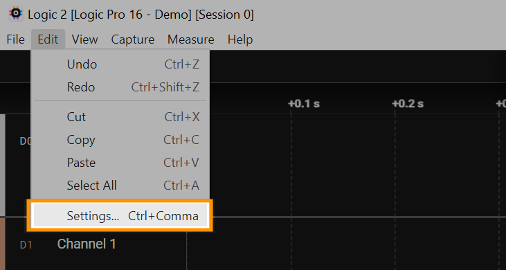

# Import Custom Low Level Analyzer

First, click the Settings button to open the Settings window.&#x20;

* On Windows: Edit > Settings
* On MacOS: Logic2 > Settings
* On Ubuntu: Edit > Settings

<figure><figcaption>
Settings Menu
</figcaption></figure>

Then, in the Settings window, scroll to the bottom until you reach the Custom Low Level Analyzers section.

Click the browse button to select the directory that contains your compiled custom protocol analyzer.

Finally, save the dialog and restart the software. Your custom analyzer should now appear in the list of available protocol analyzers!

### MacOS Errors

If you're running the app on MacOS, you may run into a "Failed to Load Custom Analyzer" error message upon startup when the app attempts to load your `.dylib` (or provided `.so`) low level analyzer. The fixes for this are described in the support article below.


[failed-to-load-lla.md](../../troubleshooting/failed-to-load-lla.md)


