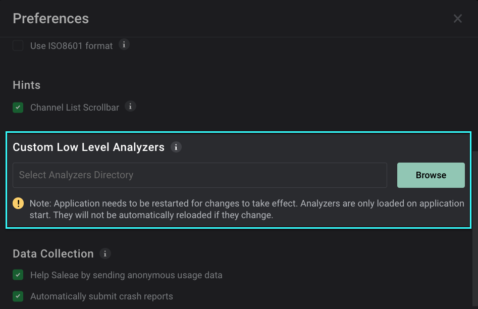

# Import Custom Low Level Analyzer

First, click the options button at the bottom-right of the software, and select "Preferences."

Then, in the Preferences window, scroll to the bottom until you reach the Custom Low Level Analyzers section.

Use the browse button to select the directory that contains your compiled custom protocol analyzer.

* Windows -> `.dll`
* Linux -> `.so`
* MacOS -> `.dylib` **(Note: This may appear as a .so file provided by some custom analyzer repositories. If so, please see the "MacOS Errors" section below)**

Finally, save the dialog and restart the software. Your custom analyzer should now appear in the list of available protocol analyzers!

### MacOS Errors

If you're running the app on MacOS, you may run into a "Failed to Load Custom Analyzer" error message upon startup when the app attempts to load your `.dylib` (or provided `.so`) low level analyzer. The fixes for this are described in the support article below.


[failed-to-load-lla.md](../../troubleshooting/failed-to-load-lla.md)


## Logic 1.x

These instructions show how to set up the Saleae software to load custom protocol analyzers.

* First, open the Options menu and select Preferences.

* Navigate to the Developer tab and click Browse in the "Search this path..." section.

* Browse to the location where the .dll, .so, or .dylib analyzer library is stored.&#x20;
* Click "Select Folder"

* Save the preferences.

* Close the software. Custom analyzers won't be loaded until the software is restarted.

### Can't Find the Options Button?

Please refer to the article below. You may be running an older version of our software.


[why-is-the-options-button-missing.md](why-is-the-options-button-missing.md)


