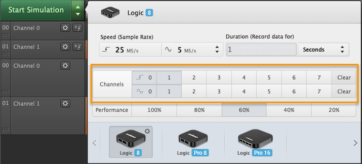
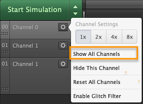

# Input Channels are Missing

There are several reasons why channels may be missing in the Logic software. Please follow the troubleshooting guide below to find the source of the issue.

#### Check that the Channels are Enabled

The appropriate channels should be properly highlighted in the Logic capture settings as shown below.

#### Show All Channels

Sometimes, channels may be hidden from view even if they are enabled under Logic's capture settings. In this case, simply click the gear icon under any of the visible channels, and click _Show All Channels_.

#### Ensure the Proper USB Port is Used

| Saleae Product   | Minimum Required USB Port                   |
| ---------------- | ------------------------------------------- |
| Original Logic   | USB 2.0                                     |
| Original Logic16 | USB 2.0                                     |
| Logic 4          | USB 2.0                                     |
| Logic 8          | USB 2.0                                     |
| Logic Pro 8      | **USB 3.0 (USB 2.0 will have limitations)** |
| Logic Pro 16     | **USB 3.0 (USB 2.0 will have limitations)** |

Logic Pro 8 and Logic Pro 16 can be used with USB 2.0 ports under certain limitations as described in the article below.


[limitations-of-logic-pro-usb2.md](limitations-of-logic-pro-usb2.md)


When used with a USB 2.0 port, Logic Pro 16 will only have 8 channels available, as opposed to having 16 channels available when used with a USB 3.0 port.
