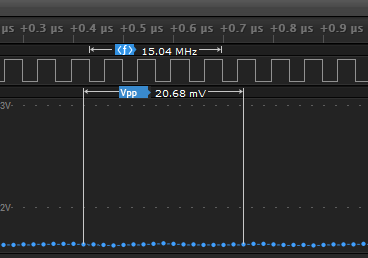

# The Digital and Analog Recording on the Same Channel Appear Different

Although the digital and analog inputs for each channel share the same input signal, several things happen to the signal before it is recorded, which can cause the two signals to appear differently.

Logic Pro 8 and Logic Pro 16 use comparators in the digital signal path. The Logic 8 and Logic 4 use simpler buffer chips and do not have selectable voltage thresholds.

The digital signal first passes through a low pass filter to attenuate pulses that are significantly smaller than the device's maximum digital bandwidth. This helps eliminate high-frequency noise that is above the bandwidth of the device from getting into the capture.

After that filter, the input is connected to a digital comparator, which is also fed with a selectable reference voltage. In the case of Logic 8 or Logic 4, a digital buffer chip is used. That signal is finally passed into the FPGA where it is sampled at the internal sample rate of the device (500 MSPS for Pro devices, 100 MSPS for Logic 8). In the case of Logic 4, no FPGA is used, and the data is sampled using the latch feature of the digital buffer IC.

The analog path for all devices first goes through a high-order, anti-aliasing filter. This is critical to remove frequencies above the advertised bandwidth of the device. This is the number-one reason you will see significant variation between digital and analog signals above the analog bandwidth of the device.

In addition to the hardware AA filter, there is a digital-analog filter that engages for sample rates lower than the advertised sample rate. This is called the decimation filter. It will filter the data further before down sampling so data sampled at lower rates does not suffer from aliasing from frequency components that made it through the analog AA filter.

### Examples of Deviation Between Digital and Analog Signals

*   Logic Pro 8 or 16: 5 MHz square wave

    Digital Sample Rate: 25 MSPS or greater

    Analog Sample Rate: 50 MSPS (maximum)

    The digital input will show a 5 MHz square wave.

    The analog input will show a 5 MHz sine wave.

    
<figure><figcaption></figcaption></figure>

*   Logic Pro 8 or 16: 10 MHz square wave

    Digital Sample Rate: 50 MSPS or greater

    Analog Sample Rate: 50 MSPS (maximum)

    The digital input will show a 10 MHz square wave.

    The analog input will show an attenuated 10 MHz sine wave.

    The peak-to-peak amplitude will be attenuated by the 5 MHz AA filter.

    
<figure><figcaption></figcaption></figure>

*   Logic Pro 8 or 16: 15 MHz square wave

    Digital Sample Rate: 100 MSPS or greater

    Analog Sample Rate: 50 MSPS (maximum)

    The digital input will show a 15 MHz square wave.

    The analog input will show a flat line.

    Zoomed in, the analog data points will form a highly attenuated 15 MHz sine wave.

    
<figure><figcaption></figcaption></figure>

**Phase Difference between Analog and Digital Channels**

Typically, analog channels will be delayed by about 1 analog sample when compared to the same digital channel, as shown in the images provided above.
