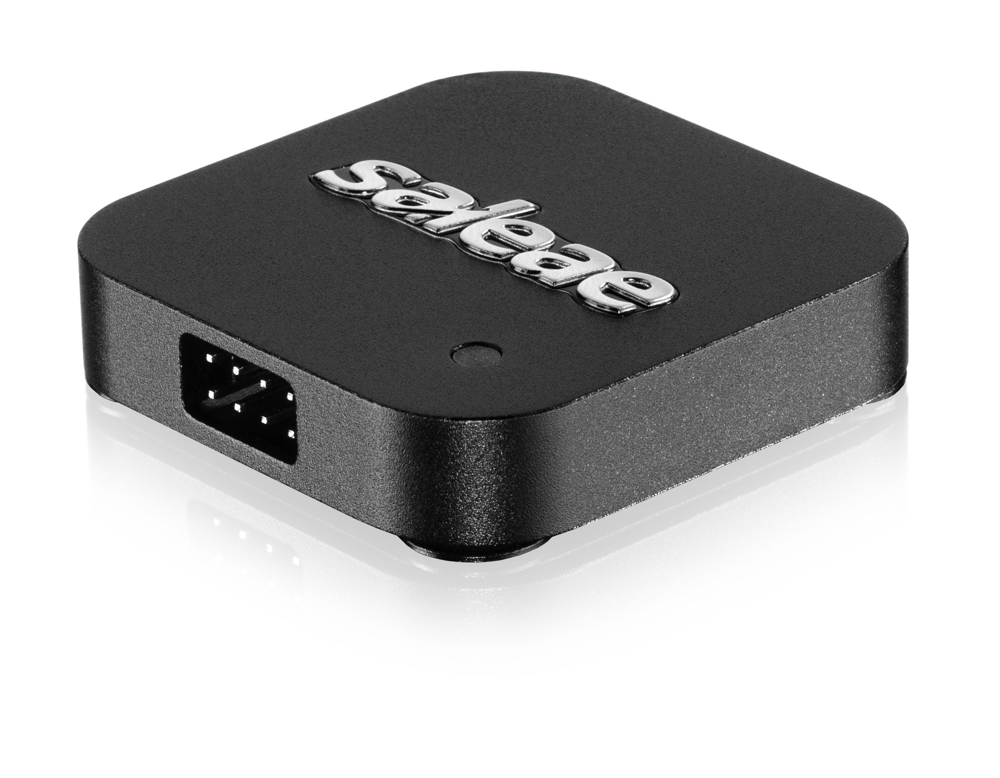
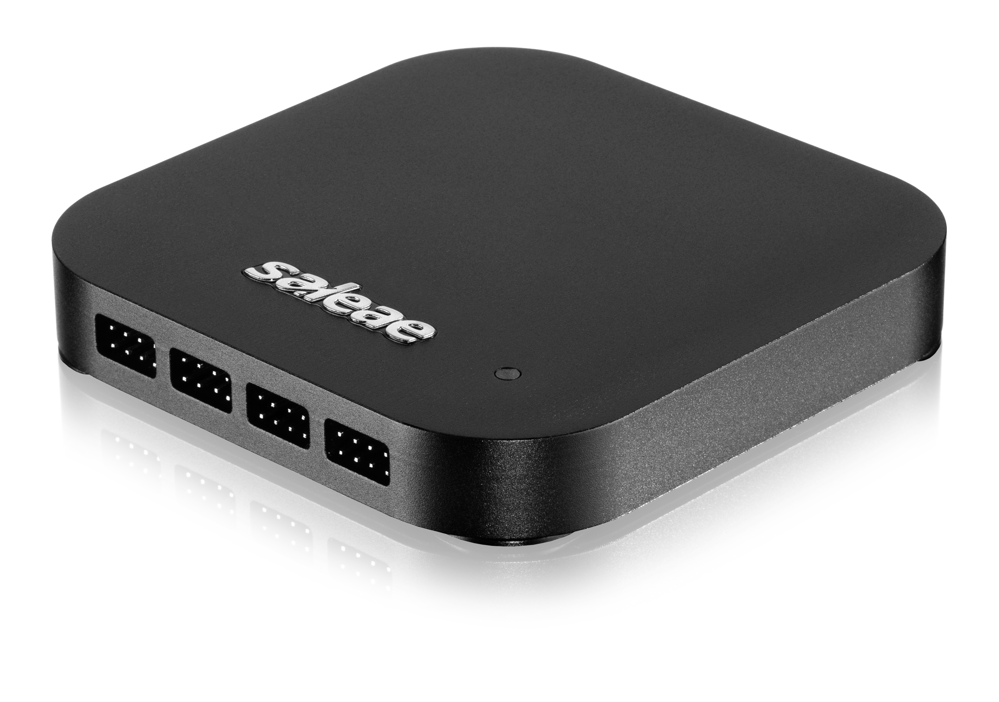
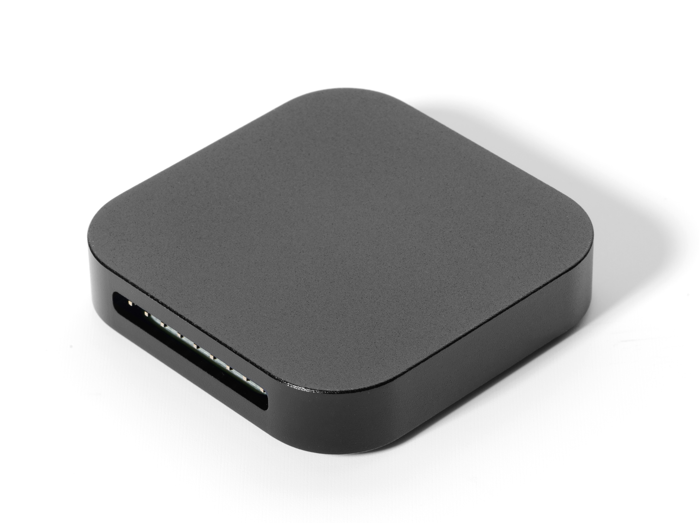
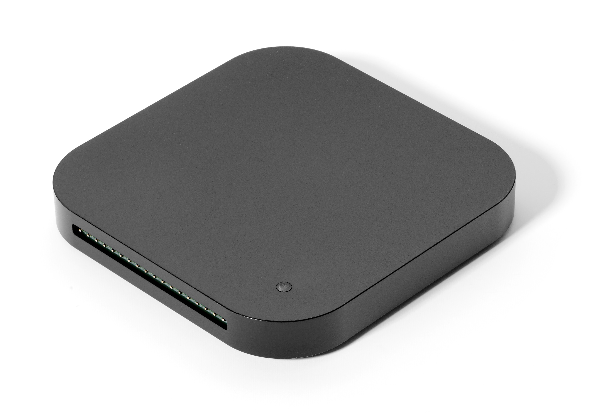

# How to Identify Each Saleae Device

On the back of every product is the name of the product.

Logic 4, 8, Pro 8, and Pro 16 feature an embossed Saleae logo on the top. On the back, the Saleae logo is laser etched, along with the name of the product. Each of these four products is available in red or black and feature all-aluminum enclosures with metal feet.

For the Logic16, now usually referred to as the original Logic16, there is no logo on the top, but it does feature a green LED. On the back, Logic16 includes the name "Logic16" and the website www.saleae.com.

For the Logic, now usually referred to as the original Logic, there is also no logo on the top, and the device does not have an LED. The back of the unit includes the name "Logic" and the website www.saleae.com.

The original Logic has gone through several enclosure variations. All are black anodized aluminum. The original enclosure design was all aluminum, with the name and website laser etched on the back (the side with the visible screws). Newer versions included a rubber base, which includes the name and website as part of the mold, the same as the original Logic16.

There can be understandable confusion between the original Logic and the new Logic 8, and there is also some confusion between the original Logic16 and the new Logic Pro 16. In these cases, we often refer to the older units as first generation, or gen 1.

**Product Names and Product Part Numbers**

The official Saleae part number is not listed on the device. Just the device's name is shown. Below is a list showing each product name and part number.

* SAL-00109    Logic 4 Black
* SAL-00110    Logic 4 Red
* SAL-00111    Logic 8 Black
* SAL-00112    Logic 8 Red
* SAL-00113    Logic Pro 8 Black
* SAL-00114    Logic Pro 8 Red
* SAL-00115    Logic Pro 16 Black
* SAL-00116    Logic Pro 16 Red

Note: "Red" or "Black" is not written on the device. This refers to the enclosure cover of the device.

* SALEAE001    Logic (original)
* SALEAE009    Logic16 (original)

A complete list of product numbers and names, including accessories, can be found below.


[saleae-part-numbers.md](../../../ordering/ordering-and-shipping/faq/saleae-part-numbers.md)


**Product Images**

**Logic 4**

<figure><figcaption>
Logic 4
</figcaption></figure>

**Logic 8**

_Note: The bottom of the device will read either "Logic 8" or "Logic Pro 8" to differentiate between the two models._

<figure><figcaption>
Logic 8
</figcaption></figure>

**Logic Pro 8**

_Note: The bottom of the device will read either "Logic 8" or "Logic Pro 8" to differentiate between the two models._

<figure><figcaption>
Logic Pro 8
</figcaption></figure>

**Logic Pro 16**

<figure><figcaption>
Logic Pro 16
</figcaption></figure>

**Original Logic**

<figure><figcaption>
Original Logic
</figcaption></figure>

**Logic16**

<figure><figcaption>
Logic16
</figcaption></figure>
