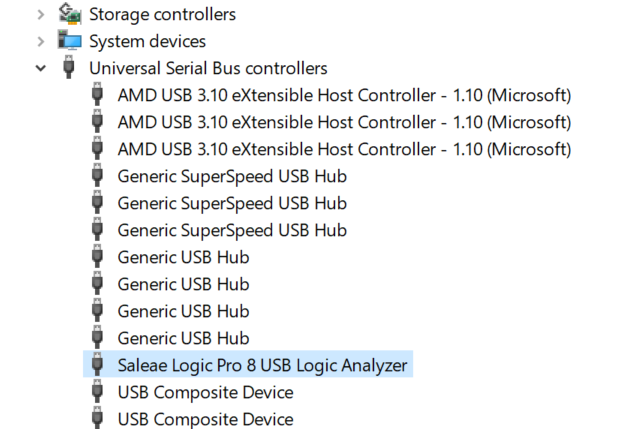
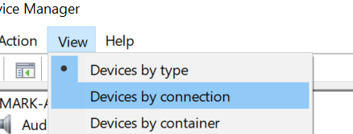
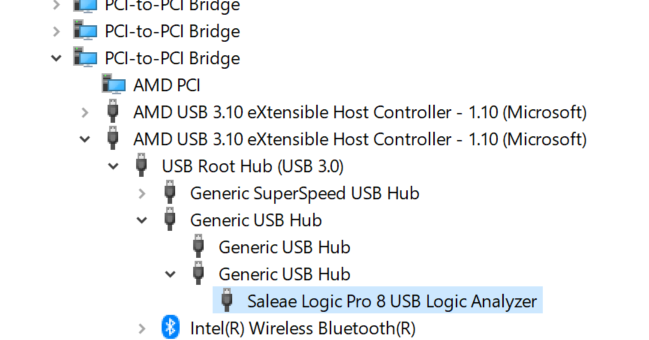

# Moving Logic to Its Own Host Controller

You may want to move Logic to its own host controller when running into the issue described in the below article.


[device-not-able-to-keep-up.md](../device-not-able-to-keep-up.md)


To move the logic analyzer to its own host controller, with no other devices on that host controller, your PC will need at least 2 host controllers. Some laptops will only have one. Follow the steps below for your specific operating system.

### Windows

1. Open Device Manager
2. Connect your Logic device (do not open the software)
3. Locate your Logic device under the section "Universal Serial Bus Controllers" in Device Manager
4.  Select your Logic device, so it is highlighted\

    <figure><figcaption>
Select your Logic device
</figcaption></figure>
5.  From the view menu, select "View devices by connection (Note, your Logic device needs to be selected when you do this, otherwise it will be lost in the tree view)\

    <figure><figcaption>
View Devices by connection
</figcaption></figure>
6.  The view will transform, but your Logic device should be still selected. Now trace the tree view up to locate the USB eXtensible host controller that is associated with it.\

    <figure><figcaption>
Locate the USB eXtensible Host Controller Associated with your Logic
</figcaption></figure>
7. Note which host controller it is (USB 3.1 or USB 3.2)
8. From the view menu, change back to "Devices by type"
9. Move the your Logic device to a new USB port
10. Repeat the process from step 3, until you've checked every port on your computer

### **OS X**

1.  Open System report. Apple menu -> About this Mac -> System Report.

    &#x20;Select USB under hardware on the left.&#x20;

    &#x20;Note: Be sure to refresh this after each hardware change.
2. Locate Logic. Note: If the software is not running or the LED is not on (for LED models), then the device may appear as Vendor Specific Device. Launch the Saleae software and refresh the view for it to change to the device name.
3.  Move non-logic analyzer devices to the other host controller when possible.

    &#x20;Doing that with a USB hub is the fastest.&#x20;

    &#x20;Note: Some devices might be internal to the Mac and cannot be used.
4. Test Logic performance. Optionally, repeat, putting Logic on the other host(s).

### **Linux**

1. Run lsusb -t. That will show all devices and hosts as a simple tree view.
2. Locate Logic. Note: The original Logic may appear as Lakewood Research.
3.  Move non-logic analyzer devices to the other host controller when possible.

    &#x20;Doing this with a USB hub is the fastest.&#x20;

    &#x20;Make sure to re-run lsusb -t for each port you test.
4. Test Logic performance. Optionally, repeat, putting Logic on the other host(s).
