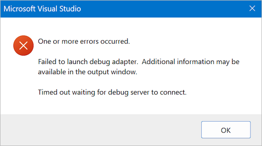

# Visual Studio Error: Failed to Launch Debug Adapter

When debugging a custom low level analyzer, and when attempting to attach a debugger to the Logic 2 software via the [instructions here](https://github.com/saleae/SampleAnalyzer/blob/master/readme.md#debugging), the following Microsoft Visual Studio error pop-up may appear.

<figure><figcaption>
Failed to launch debug adapter error message
</figcaption></figure>

The solution for this is to ensure you follow the debugging instructions linked above. Depending on your Visual Studio default configuration, another option (such as "Python code" like shown in the image below) may be selected.

<figure><figcaption>
Python code is incorrectly selected by default
</figcaption></figure>

Specifically, "Native code" needs to be selected in the Debug menu in Visual Studio.

<figure><figcaption>
Select "Native" code
</figcaption></figure>

