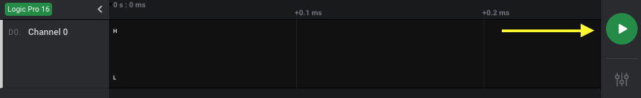

# Setup

The Saleae Logic Analyzer is a powerful tool capable of capturing multiple signals from a digital circuit and displaying that information in the form of timing diagrams. Saleae’s _Logic_ software can help you decode a variety of digital protocols, including UART, SPI, I2C, 1-Wire, I2S, CAN, USB, and many more. These features can make debugging your embedded designs much simpler.

To begin, download and install the _Logic 2_ software from the [Logic 2 download page](https://ideas.saleae.com/f/changelog/).

If you do not have a logic analyzer, you can still try out the _Logic 2_ software with simulated data. Once the software starts, simply click the **Start Button**.

Connect one or more cable harnesses to the Saleae Logic Analyzer. Note that each cable harness has an arrow on the top of the connector. This arrow should point up \(same side as the Saleae logo\) and to the left \(the side with the ‘S’ in Saleae\).

The unlabeled black wires are ground \(GND\), and the signal wires are labeled 0-8 \(repeated if you have the Logic Pro 16\). Looking straight at the ports of the analyzer, the top row of pins are labeled 0-8.

Build your test circuit, connect at least one ground wire to your circuit's ground node, and connect one or more signal wires to the nodes you wish to measure. Note that all ground pins are shorted internally. Therefore, only one ground pin needs to be connected to your test circuit at a minimum.

