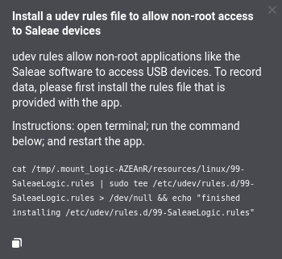

# Driver Install

Normally, when the Logic software is installed, the product should simply work when connected to the PC. In case you run into any issues with this, the drivers may need to be installed manually.

#### Device Shows up as _WestBridge_ or _unidentified device_

A common issue in Windows is that the Saleae Logic may show up as a _WestBridge_ or _unidentified_ device in device manager. If this is the case, then there is a problem with the Saleae driver. Please install the driver per the methods listed in this support article.

If the drivers are installed properly, you should see _Saleae Logic X USB Logic Analyzer_ in Device Manager, where "X" is the specific product version (4, 8, Pro 8, Pro 16).

## Manual Driver Installation (Windows)

### Location of Driver Files

To manually install your drivers on Windows, in case you're running into the issue above, or if you are using the standalone version of our software which doesn't install drivers automatically, you will need access to the driver files. There are several ways of obtaining them mentioned below.

* For the Logic 2 software, the Drivers folder is located below:
  * `C:\Program Files\Logic\Drivers`
* For the legacy Logic 1.x software (standalone), the Drivers folder is located below:&#x20;
  * `<Logic standalone folder>\Drivers\Windows`
* For the legacy Logic 1.x software (installed), the Drivers folder is located below:&#x20;
  * `C:\Program Files\Saleae LLC\Drivers`
* In case you don't have a previous installation of the Logic software, we provide the Drivers folder via the download link below.



### Method 1: New Hardware Wizard Installation

We want to get to the new-hardware wizard for Logic. Please connect Logic to the PC and open Device Manager. In Windows 10 and 8.1, you can right-click on the Windows logo in the lower left and select Device Manager.

In Device Manager, Logic might show up right away as an unknown device with a warning icon next to it. Right-click this and select Update Driver.

Select the second option for "Browse my computer for driver software."

Use the Browse button to direct the driver wizard to the Drivers folder, which is detailed above under the section titled _Location of Driver Files._

Click Next. If this fails, continue below.

### Method 2: "Have-Disk" Manual Installation

Open the Device Manager. Right-click the Logic device and select Update Driver. Click "Browse my computer for driver software."

Click "Let me pick from a list of device drivers on my computer."

Next, it will ask you for the device type. Select "Universal Serial Bus Controllers."

This option is only present if no existing driver is installed. If a driver is already installed, this step will be skipped.

Now you will be presented with a window like shown below. Click the "Have Disk..." button.

This will open the install from the disk window, which will assume that you have inserted an installation disk into drive A with the drivers. Click browse, navigate to the drivers folder, which is detailed above under the section titled _Location of Driver Files_, and select `Saleae.inf`.

At this point, you should see either just the device you have connected or both Logic and Logic16. See below for details before selecting the device you are using.

If the checkbox for "Show compatible hardware" is checked, only 1 device should be shown. If it is not the correct device, then uncheck it to see all available Saleae drivers, as shown below.

These are all of the drivers that are included with the latest beta software, which you should see in the list when the checkbox for "Show compatible hardware" is not selected.

Saleae Logic 4 USB Logic Analyzer\
Saleae Logic 8 USB Logic Analyzer\
Saleae Logic Pro 16 USB Logic Analyzer\
Saleae Logic Pro 8 USB Logic Analyzer\
Saleae Logic Start USB Logic Analyzer\
Saleae Logic USB Logic Analyzer\
Saleae Logic 16 USB Logic Analyzer


It's VERY important to select the correct product. Selecting the wrong product will cause our software to download the wrong firmware image, causing undefined behavior.


There is some naming confusion here that I would like to clear up.

If you purchased the Logic 4, the Logic Pro 8, or the Logic Pro 16, please select the driver that matches the product name.

If you purchased the new Logic 8, our logic 8 channel logic analyzer with digital and analog, released in September 2014, please use the driver "Saleae Logic 8 USB Logic Analyzer" and NOT the driver "Saleae Logic USB Logic Analyzer." If you have the original Logic unit, 8 channel, digital only, discontinued in mid-2014, please select "Saleae Logic USB Logic Analyzer" and not the one with the number 8.

The original Logic 16, also discontinued in 2014, uses the "Saleae Logic 16 USB Logic Analyzer" driver and NOT the pro version.

### Method 3: Uninstall and Reinstall Existing Logic Driver

When connecting Logic to the USB port and starting the Logic software, the Device Manager may show the device as "Logic Pro." This is incorrect, and may cause issues with operation. The solution is to uninstall and reinstall the Logic driver on the PC.

Solution steps if the device incorrectly appears as "Logic Pro" under Device Manager:&#x20;

1. Close Logic software, but keep the Logic device connected to the PC
2. Open Device Manager
3. Right click "Logic Pro" in the Device Manager
4. Click "Uninstall device"
5. A window will popup indicating that you are about the uninstall the device from your system
6. Select the checkbox that says "Delete the driver software for this device"
7. Click "Uninstall"
8. Unplug and replug the Logic analyzer
9. Open the Logic Software. The Logic device should now connect to the Logic software.

### Contacting Us for Further Support

If at the end of this process you still get an error, please [contact support](https://contact.saleae.com/hc/en-us/requests/new) and include the following information:

* What OS and OS version you are using and if it is 32-bit or 64-bit.
* If the device has worked on this PC before.
* If the device has worked on other PCs before.
* Any information that may have been displayed when the drivers failed to install.
* How does the device show up under Device Manager?
* The driver install logs locations are described below.
  * On Windows, it should be located below:&#x20;
    * `C:\WINDOWS\INF\setupapi.dev.log`

## Linux Ubuntu Instructions

When the Logic 2 software is opened, a udev rule file is checked. If the udev rule is missing, then an error message will popup to prompt you to install the proper udev rule file. The good news is that, if you see this popup, then our software was able to detect the device. Follow the instructions to open the terminal and run the command to install the udev file.

Instructions:&#x20;

1. Ensure the Logic app is running and your Logic analyzer is connected
2. Open terminal
3. Run the command below (replace "xxxxxx" with the characters shown in your "Install a udev rules" popup window)
4. Close the Logic app
5. Disconnect and reconnect your Logic analyzer
6. Open the Logic app

`cat /tmp/.mount_Logic-xxxxxx/resources/linux/99-SaleaeLogic.rules | sudo tee /etc/udev/rules.d/99-SaleaeLogic.rules > /dev/null && echo "finished installing /etc/udev/rules.d/99-SaleaeLogic.rules"`

#### Installing the udev Rule Manually

In case you run into any issues with installing the udev rule file using the command mentioned above, you can attempt to install it manually.

1\. Download the udev rule file below.



2\. Copy the file into the rules directory with the following command:\
`sudo cp 99-SaleaeLogic.rules /etc/udev/rules.d`

3\. Verify that the rule file was installed with the following command:\
`cat /etc/udev/rules.d/99-SaleaeLogic.rules`

4\. If Logic was connected during the install, unplug and reconnect your Logic device to the PC.

5\. If at this point, the udev rule has still not installed properly, please disconnect your Logic device and restart your PC and test again afterwards.\
&#x20;\
In case the above steps don't help, please [contact support](https://contact.saleae.com/hc/en-us/requests/new) and send us the command line output from the udev rull install commands above.
