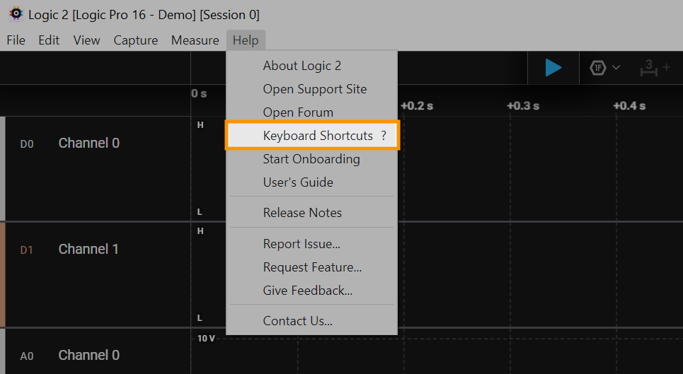

# Keyboard Shortcuts

The list of keyboard shortcuts for the Logic 2 software can be viewed by clicking Help > Keyboard Shortcuts. You can also use the "?" key on your keyboard to quickly open the list of keyboard shortcuts in the software.

<figure><figcaption>
Keyboard Shortcuts menu button
</figcaption></figure>
