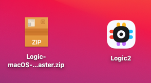

# Installation

Before installing the software, please review the supported operating systems in the link below.


[supported-operating-systems.md](supported-operating-systems.md)


The software is available free of charge, and can be installed on as many machines as you like. The latest release of the Logic 2 software can be downloaded [here](https://www.saleae.com/downloads/)!

### **Ubuntu Instructions**

The Logic 2 software is provided in an AppImage format, which contains all the files needed for the software to run. In Linux, you may need to allow executing the file as a program. To do this:

1. Right-click the AppImage file and click Properties
2. Check the box that says "Allow executing file as program"

#### Extracting the AppImage

You can extract the AppImage with `./Logic-2.x.xx-master.AppImage --appimage-extract`, which will dump the contents to a new directory called squashfs. You can then run the Logic binary directly from there.

### MacOS Instructions

First, double-click the Logic 2 .zip file available on our [download page](https://www.saleae.com/downloads/). This will extract the Logic 2 application file. From here, you can double click the Logic2 app to run it.

Alternatively, you can also drag the Logic2 app file into your Applications folder in case you would like to have the app appear in Launchpad.

### Windows Instructions

Simply download and run the installer available on our [download page](https://www.saleae.com/downloads/). We install a driver for the Logic hardware as part of the installation process, so you will be prompted to trust software from Saleae.

### Install Errors

.png>)

In case you run into any installation issues, please refer to the support article below.


[will-not-install.md](../troubleshooting/will-not-install.md)


