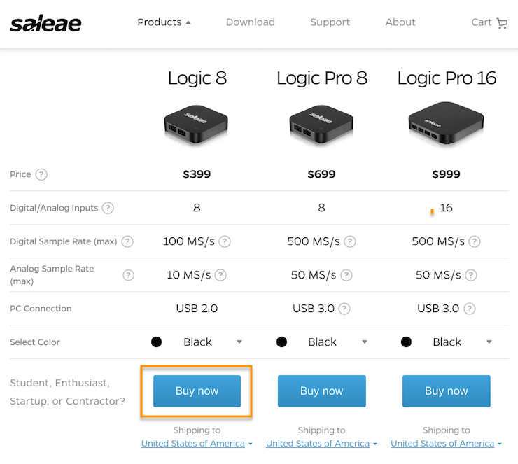

# Pricing and Availability

## Pricing and Availability

### Pricing

You can find the pricing and part numbers for all of our products below:



To check the cost of shipping, simply add the product to your cart on [www.saleae.com](https://www.saleae.com/), select your country, and enter your postal code.

### Availability

Stock status and ship date estimates can be found on [www.saleae.com](https://www.saleae.com/) and are kept up-to-date.

To check the stock status and lead time of a product, navigate to [www.saleae.com](https://www.saleae.com/), and click the Products button.

Locate the item you are looking for. If you are looking for an accessory, check the [accessories page](https://www.saleae.com/accessories).

Click the Buy Now button.

In the cart, the stock status and lead time are shown for each product.

Normally, all units are in stock. If you decide to purchase a unit when it is out of stock, there will be an additional required checkbox on the cart page to remind you that your order may be delayed.

