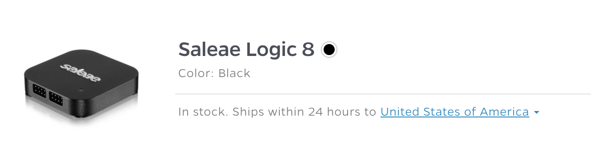

# Pricing and Availability

### Pricing

You can find the pricing and part numbers for all of our products below:


[saleae-part-numbers.md](faq/saleae-part-numbers.md)


To check the cost of shipping, simply add the product to your cart on [www.saleae.com](https://www.saleae.com/), select your country, and enter your postal code.

### Availability

Stock status and ship date estimates can be found on [www.saleae.com](https://www.saleae.com/) and are kept up-to-date.

To check the stock status and lead time of a product, navigate to [www.saleae.com](https://www.saleae.com/), and click the Products button. You may also click on the Accessories button if you are looking to purchase an accessory.

In the Products dropdown window, locate the Saleae Logic model you are interested in and dlick the Buy Now button. If you are on the Accessories page, click Add to Cart on the accessory you are interested in.

In the cart, the stock status and lead time are shown for each product.

Normally, all units are in stock. If you decide to purchase a unit when it is out of stock, there will be an additional required checkbox on the cart page to remind you that your order may be delayed.
