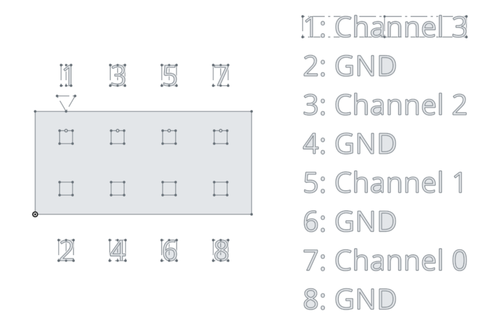
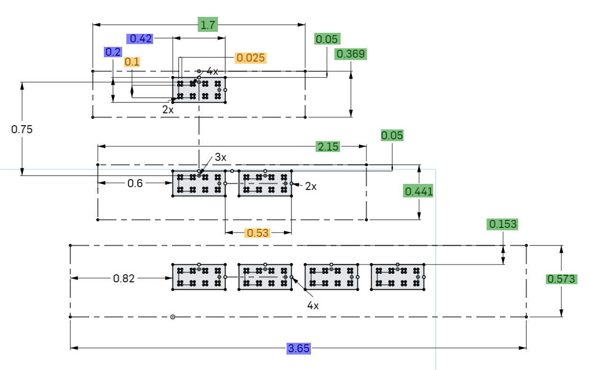

# Logic Dimensions

Below are several recommendations for integrating the Saleae devices into new designs.

### 1. Add Male Headers to your PCB

You can add 4x2 male headers to your PCB and use the Saleae accessory cable "Logic-to-2x4 Header (Gen 2)" to connect any of the current Saleae logic analyzers to your circuit. [Accessories can be purchased here](https://www.saleae.com/accessories).

Our 4x2 connectors are comprised of:

* [Molex 0016020086](https://www.molex.com/pdm_docs/sd/016020086_sd.pdf) crimp connectors (for typical .100-inch spaced headers/pins)
* [Molex 0022552081](https://www.molex.com/pdm_docs/sd/022552081_sd.pdf) plastic housing (2x4 - 2.54mm/.100in pitch)

The Gen 2 accessories are compatible with these devices:

* Logic 8
* Logic Pro 8
* Logic Pro 16

The Gen 1 accessories are compatible with these devices:

* Original Logic (discontinued)
* Original Logic16 (discontinued)
* Logic 4 (discontinued)

When using the Gen 2 Logic-to-2x4 header adapters, please use this pin out on your board (top view):

<figure><figcaption></figcaption></figure>

### 2. Add Female right-angle / Vertical headers to your PCB

You can add female right-angle headers to the edge of your board, or vertical headers to mount the logic analyzer vertically to your board.

### Dimensions for the Connectors

Below are diagrams of the connectors on the new Saleae logic analyzers. Note that Logic 8 and Logic Pro 8 have the same dimensions.

<figure><figcaption></figcaption></figure>

The dimensions for the connectors on our Logic products are available on [OnShape](http://www.onshape.com), named [Saleae Pinout Gen2](https://cad.onshape.com/documents/3639851e3a52499691159c81/w/c1d2f96bff954fc38299a060/e/9a4c6d0887ae4833a561c8c2). A free account is required with OnShape to view them.
