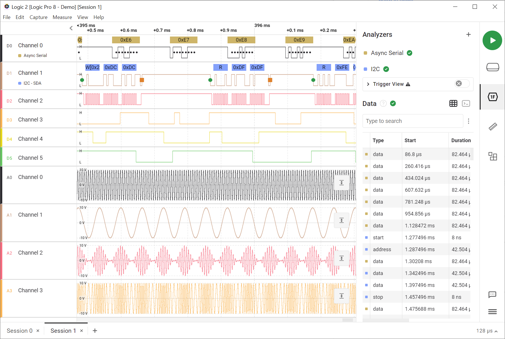
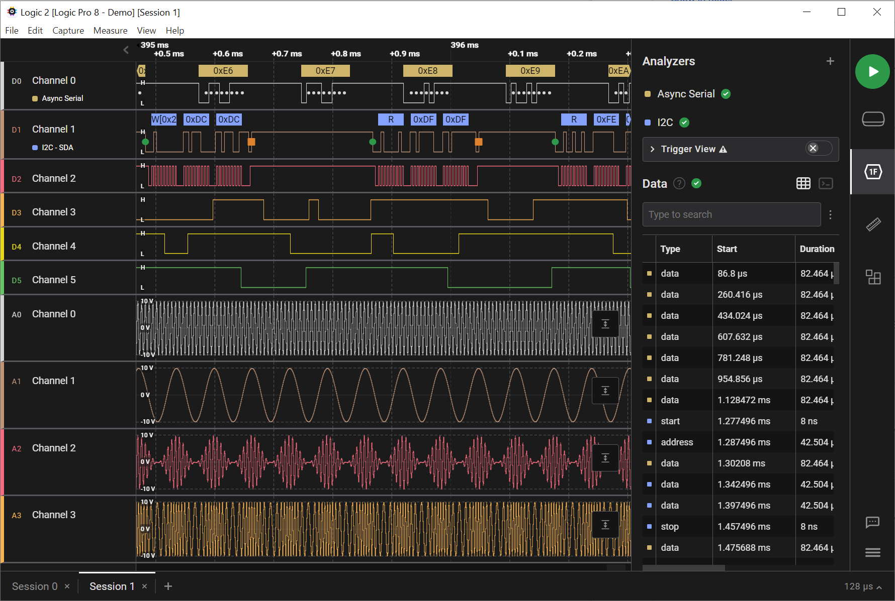

# Color Themes

The color theme for the Logic 2 software can be adjusted from within the Preferences window, which can be reached by clicking the Options button (3 lines) at the bottom-right of the software.

<figure><figcaption>
Light and Dark Theme Option
</figcaption></figure>

### Light Theme

<figure><figcaption>
Light Theme
</figcaption></figure>

### Dark Theme

<figure><figcaption>
Dark Theme
</figcaption></figure>
