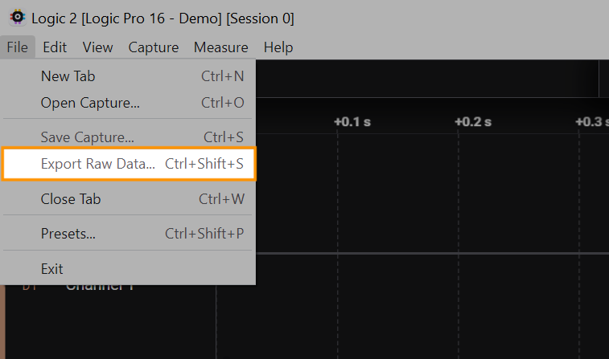
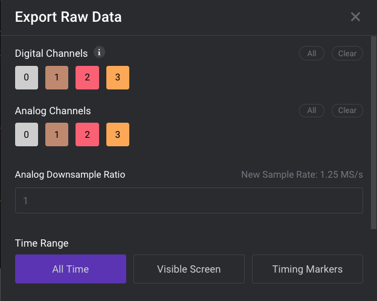

# Exporting Data

### Exporting the Data Table

The Logic 2 software allows exporting of the entire Data Table, which can include entries from all of your added analyzers. To export the Data Table, click the 3 dots to the right of "Data," then click "Export Table."

### Exporting Raw Data

To export raw data from your capture, click the Options button at the bottom right of the software, then click "Export Raw Data."

<figure><figcaption>
Export Raw Data
</figcaption></figure>

You will be greeted with an "Export Raw Data" window. From here, you can select the channels you would like to include in your export, the analog downsample ratio (if analog channels are included), and the time range.

Scrolling down the "Export Raw Data" window reveals more options, including the desired Export Format, as well as the Export Location. An "Always Replace" option is also available to continuously overwrite your previous exported files in the specified Export Location.

#### Format of the Raw Data Export

Digital channel entries are only recorded in the export file when data changes. Therefore, the number of entries in the resulting export file are dependent on the number of transitions that occur and not on the number of digital samples in the capture. This helps reduce the file size of the export file.

Having said that, we always create a new entry on the final digital sample, meaning that the last 2 entries in your raw data export file will not include any data changes on the digital channels. This is because we want to help the user determine how much data was captured and exported down the last sample, even though there were no data changes.

<figure><figcaption>
Last sample in the capture will always be printed
</figcaption></figure>

### Exporting Analyzer Results

To export your individual analyzer results, click the 3 dots next to the particular analyzer you'd like to export data for. Then click "Export to TXT/CSV." You will be greeted with an OS prompt to save your export file.

#### This Analyzer's Native Export is Not Supported in Logic 2 - Warning Popup

For some analyzers (namely MDIO, CAN, and LIN), you will run into an error popup that prevents you from exporting the analyzer from the analyzer's drop down menu. In this case, we recommend exporting via the data table instead. More information on this behavior can be found below.


[this-analyzers-native-export-is-not-supported-in-logic-2.md](../../../getting-help/troubleshooting/this-analyzers-native-export-is-not-supported-in-logic-2.md)


## Community Shared Export File Parser

A community user has generously shared their Python-based export file parser. Their GitHub repository for it can be found here: [Saleae Output Parser](https://github.com/idaholab/Saleae_Output_Parser)

