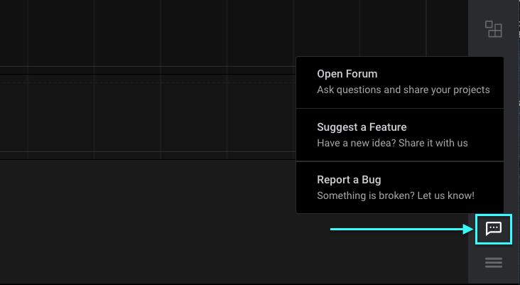

# Message Us Directly

You may contact us directly through the Logic 2 software via the messaging icon at the bottom right.

From here you can...

* Ask a question on our forum
* Suggest a feature
* Report a bug

Suggesting a feature and reporting bugs will open up a support ticket with us via email. We review all suggestions and bug reports! We may also contact you back for more information, or for any updates we have regarding your submission.
