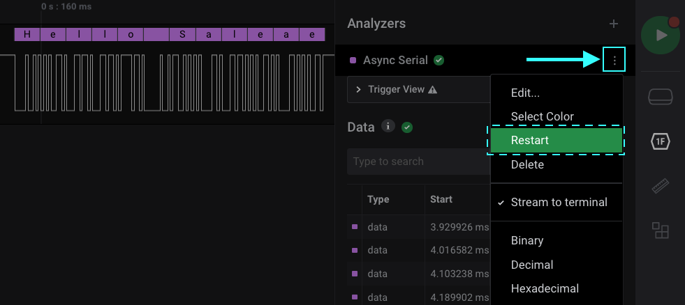

# Analyzers

Our tutorial video below demonstrates the basics of decoding data using protocol analyzers. The video covers the following topics:

* The basics of protocol analyzers
* Capturing and decoding SPI data
* Configuring the SPI analyzer
* Changing the display radix
* Navigating using the Data Table



### Protocol Bubble Merging

When zooming out, we've implemented a feature that merges seperate protocol bubble results into a single protocol bubble. The decoded data in the newly merged bubble will be displayed in sequential order. A number will also appear on the left side of the bubble. This number indicates how many protocol bubbles were merged together.

### Troubleshooting Analyzer Issues

#### 1. Restart Analyzers

In case an analyzer is producing incorrect results, or in case an analyzer has gotten stuck processing data, one solution might be to restart the analyzer. This will have the same effect as deleting and re-adding the analyzer, and may allow the analyzer to get unstuck from a bad state. To restart the analyzer, click on the three dots next to the analyzer and select "Restart." [Contact us](https://contact.saleae.com/hc/en-us/requests/new) if this occurs as this may be a bug in the analyzer.

#### 2. Filtering Glitches from your Capture Data

The glitch filter is designed to help remove noise picked up in the digital recording. This can be especially useful when using protocol analyzers, since present noise may prevent proper decoding of digital data. More information on enabling the glitch filter can be found below.


[software-glitch-filter.md](software-glitch-filter.md)


