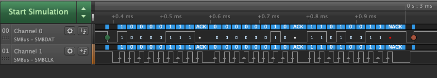
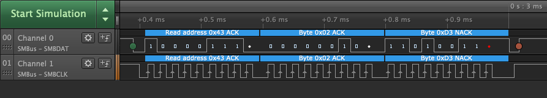

# SMBus Analyzer - User Guide

The Saleae Logic software includes the ability to decode SMBus data. The SMBus Analyzer allows you to decode the SMBDAT and SMBCLK lines with some configuration settings which can change how the data can be viewed.

### Setting up the SMBus Analyzer

The SMBus Analyzer has the following settings.

First, select the channels for the SMBDAT and SMBCLK lines.

Then, select the SMBus decode level. This will change the way the decoded captured data is displayed on the Logic software.

### **SMBus Decode Level Setting**

**Signals:** This will show the data in single-bit format.


Changing the Display Radix setting in the Logic software will not change the way the SMBus data is displayed. Instead, you must change the display format using the SMBus decode level setting.


**Bytes:** This will show the data in hex format, decode it as a read or write operation, and will display the bytes as an ACK or NACK. If PEC on packets need to be calculated and shown on screen, then SMBus, PMBus, or Smart Battery should be selected.

**SMBus, PMBus, & Smart Battery:** Set this to the appropriate protocol you will be decoding. When enabling the "Calculate PEC on packets" setting, the PEC will be shown when the data is decoded.

