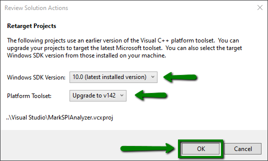
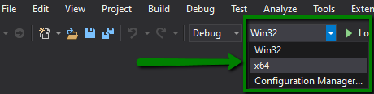

# SDK Setup

The Protocol Analyzer SDK is used to create custom plugins for the Saleae Logic software. These plugins are used to decode protocol data from captured waveforms.

### Analyzer SDK Library Setup

For this setup example, we will build the Sample Analyzer located here: [https://github.com/saleae/SampleAnalyzer](https://github.com/saleae/SampleAnalyzer)

The libraries required to build a custom analyzer are stored in the following git repo: [https://github.com/saleae/AnalyzerSDK](https://github.com/saleae/AnalyzerSDK)

You may either fork, clone, or download this repository. Forking is recommended if you plan to use version control or share your custom analyzer publicly.

Note - This repository contains a submodule. Be sure to include submodules when cloning, for example `git clone --recursive https://github.com/saleae/SampleAnalyzer.git`. 

If you download the repository from Github, the submodules are not included. In that case you will need to...

1. Download the [AnalyzerSDK](https://github.com/saleae/AnalyzerSDK) repository
2. Download the [SampleAnalyzer](https://github.com/saleae/SampleAnalyzer) repository
3. Place the AnalyzerSDK folder inside of the SampleAnalyzer folder


Once downloaded, run the script rename\_analyzer.py. This script is used to rename the sample analyzer automatically. Specifically, it changes the class names in the source code, it changes the text name that will be displayed once the custom analyzer has been loaded into the Saleae Logic software, and it updates the visual studio project.

There are two names you need to provide to rename\_analyzer. The first is the class name. For instance, if you are developing a SPI analyzer, the class names would be SPIAnalyzer, SPIAnalyzerResults, SPIAnalyzerSettings, etc. The file names would be similar, like SPIAnalyzer.cpp, etc.

All analyzer classes should end with "Analyzer," so the rename script will add that for you. In the first prompt after starting the script, enter "SPI". The analyzer suffix will be added for you. This needs to be a valid C++ class name - no spaces, it can't start with a number, etc.

Second, the script will prompt you for the display name. This will appear in the software in the list of analyzers after the plugin has loaded. This string can have spaces, since it will always be treated as a string, and not as the name of a class.

After that, the script will complete the renaming process and exit.

```text
python rename_analyzer.py
SPI
Mark's SPI Analyzer
```

### Building on Windows

First, [Download and Install Visual Studio](https://visualstudio.microsoft.com/vs/community/).

To build on Windows, open the visual studio project in the Visual Studio folder. If you are using the latest version of Visual Studio, you may need to upgrade the project to target the latest Visual C++ toolset, since this project uses an earlier version of the toolset. If the window below pops up, go ahead and upgrade the project to the latest version and click "OK".



The Visual Studio solution has configurations for 32 bit and 64 bit builds. You will likely need to switch the configuration to the appropriate build for your OS. Once the project is opened and properly configured in Visual Studio, you may build it \(Ctrl + B\). This will generate a .dll file for your custom analyzer that you can install into the Logic software.



### Building on Linux / OSX

To build on Linux or OSX, run the build\_analyzer.py script. The compiled libraries can be found in the newly created debug and release folders.

```text
python build_analyzer.py
```

### Installing your Custom Analyzer



### Debugging on Windows

Unfortunately, debugging is limited on Windows to using an older copy of the Saleae Logic software that does not support the latest hardware devices. Details are included in the above document.

To debug on Windows, please first review the section titled`Debugging an Analyzer with Visual Studio` in the included `doc/Analyzer SDK Setup.md` document.


