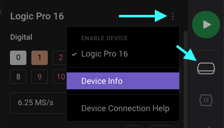
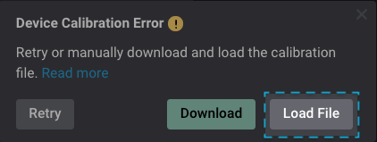

# Device Calibration

When connected to the internet, the Logic software will automatically handle downloading the calibration file. In rare cases, users may need to download the calibration file manually if the software is not able to download it on its own (typically due to network security measures).

The 2nd Generation of Saleae products (Logic 4, Logic 8, Logic Pro 8, & Logic Pro 16) use calibration data generated at Saleae to display accurate AC and DC values. The 1st Generation (Original Logic and Logic16) do not require any form of calibration.

This calibration data is not stored on the device. Instead, it is stored on our servers, and the software automatically downloads this calibration data as well as checks for updates when a device is connected.

#### Checking Calibration Status & Device Serial Number

Our support team may request you to send your serial number to us to further investigate your device's calibration status. We may also have you check your device's calibration status as reported by your software below.

1. Click the Device Settings Panel Button on the right
2. Click the three dots next to your device name on the top-right
3. Click Device Info to view the device's calibration status and serial number

<figure><figcaption>
Device Information window showing calibration status
</figcaption></figure>

#### Install Calibration via Logic 2 App

1\. If the auto-download for calibration fails, a popup will appear.\
2\. Click "Download" to download the calibration file\
3\. Click "Load File" to load the calibration file\
4\. Check calibration status to ensure it is successful

#### Install Calibration to an Offline PC

In cases when you are not able to download the calibration file from within the Logic 2 app (for instance, if you are using an offline PC), you may download the calibration file using another PC that has internet access by using its browser. This file will need to be brought over to the offline PC. The steps are shown below:

1. On the PC that has the Logic 2 app installed (which may be offline), connect your Logic analyzer via USB.
2. Navigate to the Device Information window as we show in the _Checking Calibration Status & Device Serial Number_ section above.
3. Take note of the serial number listed there.
4. On another PC that has internet access, enter the link below in your browser and add your Serial Number. This will prompt you to download a calibration file in .cal file format.
   * downloads.saleae.com/calibration/{Insert Serial Number here}.cal
   * _Note:_ Device ID must be entered in **lowercase**.
   * _For example:_ downloads.saleae.com/calibration/3b2e3a21ca4ad130.cal
5. Take this newly downloaded .cal file to your other offline PC and paste it to a convenient and temporary location, such as your Dekstop.
6. Open the Logic 2 app and connect your logic analyzer. You should be greeted by a _Device Calibration Error_ popup below. Click Load File and navigate to the .cal file you recently downloaded. Your device should now be calibrated on this PC once the file is loaded.

#### Where are my Calibration Files stored?

`OSX: /Users/YourUserName/Library/Application Support/logic/calibrations`\
`Windows: %APPDATA%\Logic\calibrations`\
`Linux: ~/.config/Logic/calibrations`

#### My Browser Opens the Following Page

When manually downloading the calibration file in Logic 2.x, in rare cases, your browser may open a page that looks like the image below.

In this case, please submit a [Warranty Request](https://saleae-support.typeform.com/to/E8UPB7) form and we will be happy to help. This may be indicative of hardware failure and we'll most likely want to process a warranty for you.

#### **Transferring the Calibration File from One PC to Another**

1. Install the latest Logic software on a machine with Internet access.
2. Open the software and connect the Logic device.
3. Wait for the device to fully connect to the software.
4. Check preferences dialog to be sure the calibration data is loaded.
5. Close the software.
6. Copy all \*.cal files from the calibration folder of that computer to the computer without Internet access.

Each .cal file is specific to a single device, but the .cal files are saved with the device ID in decimal and not hex, making it hard to tell which is which. If only one device has ever been connected, there will only be one .cal file.

#### Do I Have the Latest Calibration File?

If there is a newer calibration file available for your device, our software should automatically download it as long as it is connected to the internet. Note that we usually do not make updates to the calibration files.

In case you want to check if there is an updated calibration file available, please manually download the calibration file using the instructions above and check for the calibration status.

#### Can I Manually Adjust Calibration Values for my Logic Device?

This is one of our top requested features for which we would love to work on at some point. However, a proper implementation is a long way off. In the meantime, we have a workaround which will allow users to adjust their calibration file's analog gain & offset manually by a Python script. More information about this can be found below:

* [Discuss Forum - Quick calibration hack to adjust channel gain and offset](https://discuss.saleae.com/t/quick-calibration-hack-to-adjust-channel-gain-and-offset)

#### **Do you Provide Calibration Certificates?**

Our devices do not require periodic recalibration. You can download our statement of calibration below.



Specifically, there is no calibration certificate. The devices do undergo a one-time factory calibration process.

#### **Having Trouble?**

If you are having trouble manually downloading the calibration file, we can send it to you. Please [contact support](https://contact.saleae.com/hc/en-us/requests/new), and we can make sure your calibration data gets updated.
