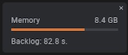

# Error: Capture stopped because backlog data exceeded 90%

When capturing data, you may encounter a backlog error message like shown below:

`Capture stopped because backlogged data exceeded 90% of the capture buffer size. Try reducing the sample rate or disable unused channels to avoid backlogging. Analyzer data might not appear.`

### Why Does the Error Message Appear?

The source of the error message is mainly due to a performance bottleneck while capturing in Trigger mode.&#x20;

We process incoming captured data in real-time while looking for the trigger. During this process, performance bottlenecks could occur, which are most commonly caused by using high sampling rates, enabling a large number of channels, and/or running on a relatively low performance PC. The glitch filter feature can also significantly slow down processing performance. This may cause a backlog of unprocessed data (i.e. "backlogged data") to start building up. If this occurs, you will notice a backlog amount (in seconds) appear in the Memory buffer usage window during a capture like shown in the image below.

When the Memory buffer gets used up while looking for a trigger, we start deleting the oldest data in the buffer in a loop-wise fashion. Deleting processed data is OK since our app has already searched it for the trigger. However, we cannot delete unprocessed, or backlogged data, since the app has not yet determined if the trigger exists in that data set. Therefore, if the amount of backlogged data reaches 90% of the Memory buffer, we simply end the capture early.

In summary, the Memory buffer setting attempts to (A) keep the memory usage of the capture below the limit and (B) stop the capture when in looping mode if over 90% of the buffer is consumed by backlogged data. Having said that, the memory buffer setting currently does not handle added analyzers and HLAs too well, and this is something we plan to improve in future revisions of the app.

### Workarounds

As mentioned in the error popup, there are two immediate workarounds to this issue:

1. Reduce the sample rate
2. Disable unused channels
3. Disable the glitch filter if used

This will help give our app a little extra processing bandwidth while looking for a trigger. As another workaround, you may also increase the Memory buffer amount. This won't prevent the backlog from occurring, but instead will delay it.\
