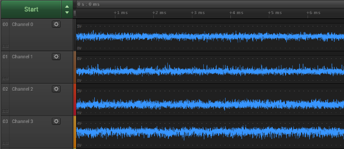

# The Captured Data Looks Incorrect

## The Captured Data Looks Incorrect

Before troubleshooting any further, please make sure you are using the [latest version of Logic software](https://www.saleae.com/downloads/).

Below is a list of all known reasons and corresponding solutions or next steps that can cause this particular issue. Please check each one, skipping any items that are not relevant \(such as issues specific to an operating system you are not using\).

For each item, first perform the test. If the test result is positive \(the test condition was met\), then attempt the corrective action.

### The Capture Fails with an Error Message

If the issue you are experiencing is that some or all of your capture attempts immediately fail with the error message shown in the link below, please read the below article.



### The Captured Data is Corrupted

If the software is able to capture data, but the captured data looks random or completely incorrect:

1. Make sure the software detects the Logic hardware properly \(the top bar of the software should display "Connected"\).
2. Check your USB Host Controller driver. There is a known issue with VIA USB host controllers. See below.



### The Analog Capture Looks Extremely Noisy

Even with the Logic hardware inputs disconnected, the analog capture may look like the image below. The solution is to simply download the [latest version of Logic software](https://www.saleae.com/downloads/). We made some incremental changes to the Logic hardware \(no new functionality\) that makes it incompatible with Logic software versions prior to 1.2.15.

**Check the Ground Connection**

Please verify the following:

* At least one ground pin from the logic analyzer is connected to the ground on your device under test.
* Verify that the wire you are using is the ground wire from the logic analyzer. On the new units, the ground wire is black with black heat-shrink and no label. On the older units, the ground wire is grey and has a white label with "ground" printed on it.

**Check to See If the Device Records Correctly when No Signals Are Connected**

* Test: Remove the wire harness\(es\) from the front of the device so all inputs are floating and no grounds are connected. Perform a short capture using all channels at any sample rate.

    If you are using the original Logic \(8 channel, digital only\), then all signals should be high during the duration of the capture.

    If you are using any of the other devices \(Logic16, Logic 4, Logic 8, Logic Pro 8, or Logic Pro 16\), all inputs should be low.

    All analog channels should be approximately 0 volts, +/- 0.02 volts. If any of the signals are off by as much as 0.2 volts, that could mean a calibration problem. If any analog signal is off by more than 0.2 volts, it could indicate device failure.

* Corrective Action: [Contact support](https://contact.saleae.com/hc/en-us/requests/new) about a warranty repair or replacement. 

**Perform a Basic Channel Functional Test**

* Test: If you are using a Logic16, Logic 4, Logic 8, Logic Pro 8, or Logic Pro 16, you will need a voltage source, preferably between 3.3 volts and 5.0 volts.

    If you are using the original Logic \(8 channels, digital only\), you do not need a voltage source.

    Set up a capture on all channels \(digital and analog\) and set the recording time for 15–30 seconds. Make sure to set the analog sample rate to a low setting, preferably 1 kSPS. Any digital sample rate is acceptable. 

    Start a capture. During the capture, take each input, one at a time, starting with input 0 and going in order to the last input, and short that input to the voltage source \(or a ground pin in the case of the original Logic\).

    You can end the capture early if you finish before the capture completes. If you are unable to finish testing all the channels within the capture time, either repeat the process faster or extend the capture time.

    In the capture, verify that each channel is initially low \(high in the case of the original Logic.\) Verify that only one channel goes high at a time and that the channels go high in order from 0 to the last channel. Make sure that none of the high pulses are out of order, such as channel 2 going high before channel 1. Note that since the original Logic's inputs are pulled up internally and the test is performed with ground, the pulses in question should be low and not high. If the device used has analog channels, make sure the analog channels display the same behavior.

* Corrective Action: Any issues in the recorded capture could indicate damaged input buffers, shorted channels, or other problems. If any results found are unexpected, please [contact support](https://contact.saleae.com/hc/en-us/requests/new) about a warranty repair or replacement. 

**Verify That the Load Impedance of the Logic Analyzer Will Not Interfere with Your Circuit**

* Test: Most Saleae devices have an input impedance of 1 Meg ohm in parallel with 10 pF. If your circuit has a very high output impedance, the logic analyzer may cause issues with the operation of your circuit.
* Corrective Action: Either buffer the signals you need to record with an even higher input impedance buffer or find another method of recording the signals.

**Check for Ground Loops or Common Mode Ground Voltage Problems**

* Test: Check to see how your device under test is powered, and check to see how the host PC is powered. Then check for other devices connecting from the host PC to the device under test.

    None of the Saleae devices are electrically isolated. That means that the ground pins on the Saleae device are connected to the USB ground. When you connect the logic analyzer to the device, you will effectively connect the device's ground to the PC's ground. If your device and PC are powered from AC main power, they will probably already be common grounded. In this scenario, if the ground pin from the logic analyzer is connected to any voltage other than ground on your device, ground current will occur and can potentially damage your device under test, the Logic analyzer, or the host PC, or harm the user.

* Corrective Action: Avoid ground loops. If this is not possible, use extra care to ensure that the ground pin from the Logic analyzer is only connected to the same ground reference on your device under test.

    If you are unable to avoid common mode ground voltage or require isolation, please consider this digital isolation evaluation kit: [http://www.digikey.com/product-detail/en/SI84XXISO-KIT/336-1765-ND/2170672](http://www.digikey.com/product-detail/en/SI84XXISO-KIT/336-1765-ND/2170672)

**Test for an Internal Enclosure Short Defect**

* Test: Disconnect the logic analyzer from the PC and the device under test. Measure the resistance from each input pin to the metal enclosure.

    The anodized areas of the enclosure are not conductive. The logo on the bottom of the product is laser etched and conductive. Probe against this logo to test for resistance.

    The large logo badge on the top is not electrically connected to the case. Be sure to use the laser etched logo on the bottom.

    The original Logic and Logic 16 are not subject to this issue.

* Corrective Action: Contact Saleae support right away. Provide the measured resistance between each input pin \(and optionally ground pin\) to the metal enclosure. Also, include a phone number and shipping address.

    If any input pin has a noticeably low resistance to the metal case, that could indicate a short inside the case due to a manufacturing tolerance issue in the metal case.

**Check for Cross Talk**

* Test: Are you seeing short pulses in your capture that you do not expect to be there? Are these pulses lined up in time with transitions on one or more other channels?

    Cross talk occurs when changes in one signal are electrically coupled to another signal. That can cause glitches \(narrow pulses\) to appear in neighboring channels with the source channel \(aggressor\).

* Corrective Action: Physically separate the flying lead probes in the wire harness between the logic analyzer and your device.

    If you are not using all the inputs on the logic analyzer, consider moving the used channels further away. For instance, instead of using channels 0, 1, and 2, use channels 0, 2, and 4.

    If the Logic analyzer model you are using supports multiple voltage thresholds, make sure you have the most applicable threshold option selected.

**Verify That the IO Voltages Used Are Compatible with the Logic Analyzer**

* Test: First, check the supported IO standards for the Logic analyzer that you are using below.



* Verify that the logic high voltage is above the logic high threshold, and make sure that the logic low voltage \(usually 0 volts\) is below the logic low threshold voltage of the device.
* Some of the Saleae devices have selectable IO thresholds. First, try the IO threshold that best matches your application, but if it does not appear correct, also try other threshold settings.
* Corrective Action: You may need to level shift your signal before it reaches the logic analyzer or provide additional over-voltage protection. In the case of the original Logic, you should not connect RS-232 signals directly to the device.

**Verify That the Bandwidth of Your Sample Rate Is Fast Enough to Properly Capture Your Signal**

If your digital capture looks correct but the analog capture does not, please see this article:



See this article for more information about the maximum digital and analog bandwidth for each device:



For more information about the bandwidth requirements for any given signal, please see this article:



