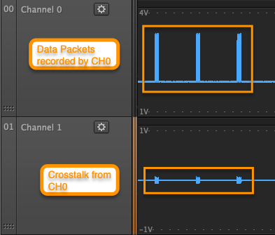

# Troubleshooting Signal Crosstalk

When capturing multiple channels of data, you might notice some amount of crosstalk in the recording. Crosstalk occurs when a high speed signal unintentionally couples, or transmits, into another signal line. Many times, this causes undesired effects on circuit operation. When this occurs, it is important to find the point at which the crosstalk couples.

In the example image below, Channel 0 is recording a high speed signal, while Channel 1 is connected to the DUT Ground. You would expect Channel 1 to show a flat line to indicate ground, but due to crosstalk, this is not the case.

### Determine the Crosstalk Source

If you believe that the Logic hardware is the source of crosstalk issues, please perform the following test.

1. Disconnect all Logic input channels from the DUT except for a single input channel at the potential source \(usually a high speed data line\). 
2. Record data on the channel connected to the high speed data line, as well as its adjacent channels \(for example, if Channel 1 is connected to the high speed data line, then record data on Channel 0, 1, and 2, while leaving Channels 0 and 2 disconnected from the DUT\). 
3. Does crosstalk appear on adjacent channels, even though they are disconnected from the DUT? If this is the case, then crosstalk is probably occurring from either the Logic probes, or from within the Logic hardware itself.

### Contacting Saleae About Crosstalk Issues

When contacting us, please provide the following:

* The tests you performed to determine the source of the crosstalk
* A description of the circuit being recorded
* A description of how the circuit is being powered \(AC power supply, USB power, batteries, etc.\)
* A description of what signals Logic is recording
* A description of how your probes are connected to your circuit
* A description of other connections between the circuit and the PC
* A description of how the PC is powered \(AC power, laptop with AC adapter, laptop on battery, etc.\)
* Any unusual noise sources \(e.g., recording signals inside an AC power supply, etc.\)
* A zipped copy of your capture file \(.logicdata file\) which shows the crosstalk

