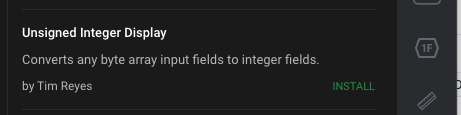
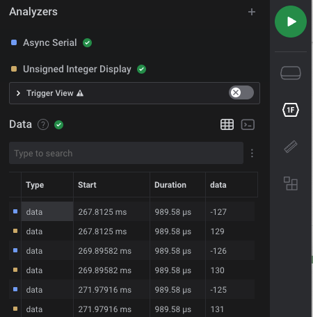

# Data Table Shows Incorrect Values

When using low level analyzers (LLAs) such as our Async Serial or SPI analyzer, you may notice issues with how values appear in the data table, specifically while viewing results in decimal format.

### Known Issues

The known issues with the data table are as follows. These are certainly things we want to fix natively from within the app, but unfortunately can't prioritize at the moment. In the meantime, we have a workaround described at the bottom of this article which utilizes an extension that is available via our in-app Extension Marketplace. More details on this workaround is described below.

#### Decimal values appear as signed rather than unsigned

In the image below, you will notice that the Async Serial decoded results above the waveform (unsigned values) do not match the values appearing in the data table (signed values). Our data table unfortunately doesn't have a schema to tell if a value is signed or unsigned. Everything in the way we handle data tables are all as signed values.

#### Decimal values appear as an array of values

In the image below, you will notice that the values in the data table appear as a series of array values, rather than a single value that matches the decoded data above the waveform. This happens when the LLA (Async Serial analyzer in the example below) is configured for greater than 8 bits of data.

### Workaround

In the meantime (and since we don't have a native solution implemented), we have published a Marketplace Extension available from within the app called "Unsigned Integer Display."

Instructions to install and use extensions can be found in the links below.


[installing-extensions.md](../extensions/installing-extensions.md)



[extensions-quickstart.md](../extensions/extensions-quickstart.md)


When the extension is used, new rows in the data table will be created which contain the values produced by the extension. In cases where the issues above are present, the extension will display the proper values. You may subsequently hide the results of the original LLA (in this case, the incorrect results of the Async Serial analyzer) so that only the correct results from the Unsigned Integer Display extension appear.

We apologize for the inconvenience this causes in the meantime.

## Logic 1.x


Unfortunately, the Decoded Protocols Panel, in addition to Protocol Search, is no longer available in the Legacy 1.x software due to technical issues. When attempting to enable it in v1.2.40, you will find our note below. Please upgrade to our newer [Logic 2 software](https://www.saleae.com/downloads/) if you need this functionality.



If you are using the older Logic 1.x software, the following troubleshooting guide applies.

### The Decoded Protocols Window Shows Incorrect Results

Specifically, we have received reports that when more than one protocol analyzer is active, the results in the Decoded Protocols window may show up incorrectly.

This bug introduces the following issues:

* Decoded messages are missing or out of order for a handful of entries under the Decoded Protocols window in the bottom-right corner of the Logic software.
* If there are errors in the Decoded Protocols window, exporting the data from this window will show the same errors.

We are working on a fix for this, but unfortunately, we don't have a timeline yet. In the meantime, please use the workarounds below.

**Temporary Workarounds**

Search for any query and delete that query in the Decoded Protocols window search box. That should reload the contents of the window and fix the results.

Type any search query:

Delete the search query to reload the window contents:

You can also export analyzer results individually by clicking on the gear icon next to the analyzer and selecting "export to text/csv file." This export method doesn't have any issues but will only let you export one analyzer at a time.

