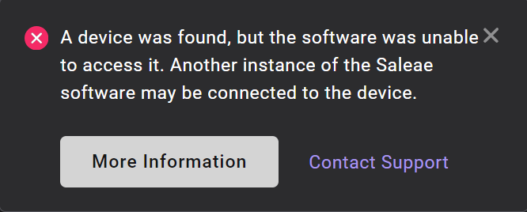

# Error Message: A device was found, but the software was unable to access it

### Windows Error Message

> A device was found, but the software was unable to access it. Another instance of the Saleae software may be connected to the device.

<figure><figcaption>
Windows error message
</figcaption></figure>

When the software detects a logic analyzer connected to the PC, it asks the operating system for an exclusive handle to the device. This error message is shown when that request is denied.

For a small number of users, this error is shown incorrectly. It is displayed every time the user connects the logic analyzer with the software open. In those cases, the device actually does properly connect to the software and can be used once the user dismisses the error message.

If the title bar says "Connected" after closing this error message, the device and software are actually working normally.

If the software still does not detect the connected device, then something is wrong. Check for other instances of Logic.exe and close them. Then remove and reconnect the device. If no other instances of Logic.exe are running, you may want to try restarting your computer and then [contact support](https://contact.saleae.com/hc/en-us/requests/new).

### Linux Error Message

> A Logic device was found, but there there was a problem connecting to it. This is probably because we don't have permissions to access it. Take a look in the drivers folder for instructions, or run this program as root (i.e. use sudo from the command line). This could also be caused by having multiple instances of the Logic software running. Let us know if you still have any problems.

The software may not have permissions to access the device. Either install the udev rules file or run the software as administrator. If the udev rules file is not working, it might be a compatibility issue with your specifc Linux distro. For very old distros, the keyword "ATTR" might not be supported and can be replaced with "SYSFS". On Arch, and possibly other distros, try removing the text ENV{DEVTYPE}=="usb\_device" from the rules file.

One of our users has provided a detailed description of the solution on Linux here: [https://schou.dk/linux/saleae/](https://schou.dk/linux/saleae/)
