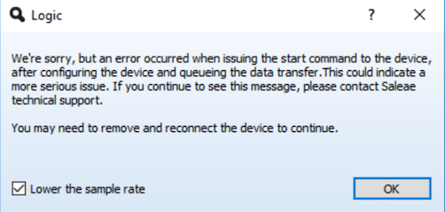

# Error When Issuing the Start Command

In the Logic 2 software, you may encounter a _DeviceSetupFailure_ error message when starting a capture.

If you run into this, please [contact support](https://contact.saleae.com/hc/en-us/requests/new).

Specifically, we have seen issues in the past when using Logic with Etron USB host controllers. If you find that your PC has an _Etron USB 3.0 eXtensible Host Controller_, please try other USB ports. This may help determine if your USB host controller is the source of the issue.

## Logic 1.x

In our older Logic 1.x software, you may encounter the following error message when starting a capture.

_"We're sorry, but an error occurred when issuing the start command to the device, after configuring the device and queueing the data transfer. This could indicate a more serious issue. If you continue to see this message, please contact Saleae technical support. You may need to remove and reconnect the device to continue"_

If you run into this, please [contact support](https://contact.saleae.com/hc/en-us/requests/new) with your USB host controller information as shown in the support article below.



