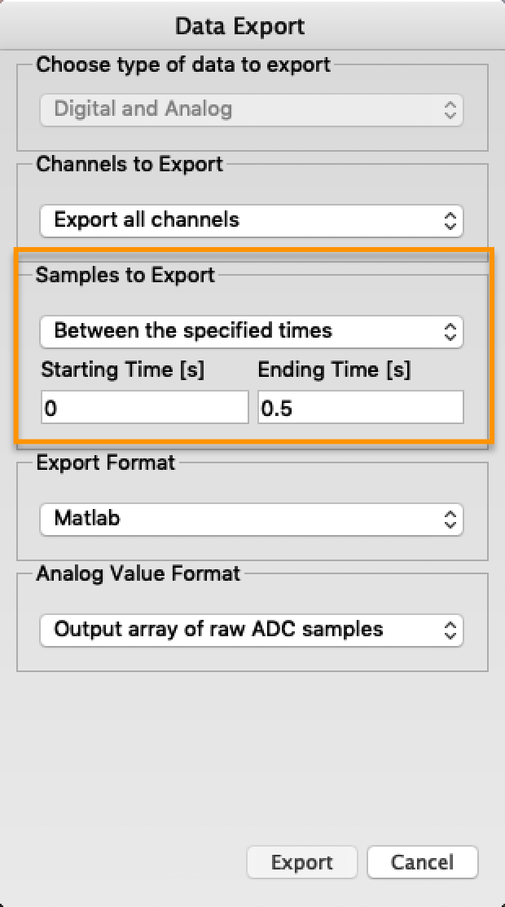

# Exported MATLAB File Causes a Crash

When trying to open a MATLAB file exported from a capture by the Logic software,  you may run into the following warning message.

```text
Warning: Unable to read some of the variables due to unknown MAT-file error.
```

Typically, this means the exported file contains too many elements for MATLAB to handle, and it is possible you are exceeding this limit, especially for long data captures. The array length limit in MATLAB is 100,000,000.  
  
One solution is to export the capture into multiple, smaller MATLAB files. Click 'Options' -&gt; 'Export Data' to bring up the Data Export window. Set the 'Starting Time' and 'Ending Time' values such that you make the MATLAB export smaller than 100,000,000 in the array.



