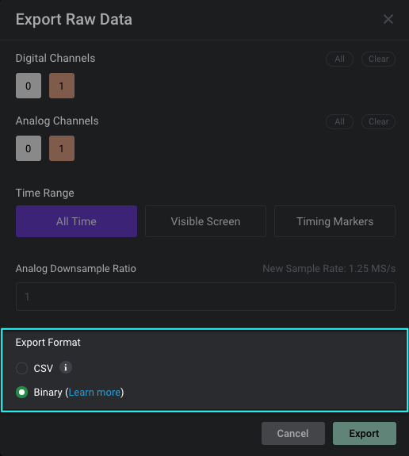

# Exporting Raw Data via CSV Takes a Long Time

We've received a few recent reports of export speed being slow when exporting raw data to a csv file. Unfortunately, exporting to a csv file has its limits, and a very densely packed digital capture, or an analog capture with a high sampling rate, may in fact take anywhere between a few minutes to several minutes depending on the capture settings used and your PC specifications.

### Performance Expectations when Exporting via CSV

Exporting via the csv file format has its limits. We might be able to squeeze out a bit more performance in terms of speed, though due to the csv file format itself, the speed increase may be in the order of a few 10s of percent. We wouldn't be able to drastically increase the speed by 10x.

### Troubleshooting Steps

Besides the csv format being quite inefficient, one area that might be causing a bottleneck in speed is the target location for the export file. For example, saving to a network drive or an external usb drive will cause limitations in export speed.

### Exporting via Binary File - A Much Faster Approach

An alternative approach \(much faster and produces a smaller file\) would be to export to a binary file. More details on the binary file format can be found in the link below.



