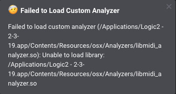

# Failed to Load Custom Analyzer: libmidi\_analyzer.so

### Error on MacOS \(libmidi\_analyzer.so\)

When attempting to run the Logic 2 software on MacOS, the following error message may appear.

`Failed to load custom analyzer (/Applications/Logic2-x-x-xx.app/Contents/Resources/osx/Analyzer/libmidi_analyzer.so): Unable to load library`

### Solution

The solution is to update to the latest version of MacOS, since our build system for Logic 2 typically targets that. When running an older version of MacOS, the error message above may appear. 

If you require using an older MacOS version and cannot update for whatever reason, you may delete `libmidi_analyzer.so` from the specified folder to get rid of the error message. This just means that you cannot use the pre-installed MIDI protocol analyzer. So long as you don't plan on analyzing MIDI data, this is OK to do.

