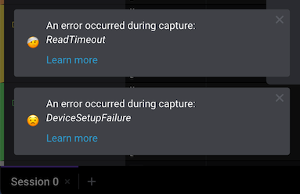

# Apple M1 Support

We have received reports of some stability issues when using our Logic 2 software with Apple's new ARM-based M1 chip. The new M1 chip is currently found in the new MacBook Air, Mac mini, and MacBook Pro models released in late 2020.

### Experimental Release Download \(Logic 2\)

We've implemented updates to the Logic 2 software that hopefully improves stability on Apple's M1 processor. We have provided a separate, experimental build of the Logic 2 software that contains these updates. The download page is available below.


Please note that this release is experimental and may contain bugs or stability issues. Please report any issues you experience with this version via the methods below.

* Comment on our Ideas site post: [Bug - Logic Unstable on Apple M1 Chip](https://ideas.saleae.com/b/feature-requests/bug-logic-unstable-on-macbook-m1/)
* [Contact our support team directly](https://contact.saleae.com/hc/en-us/requests/new)


### [**Logic 2.3.38 Experimental Release \(Apple M1\) - Download Page**](https://discuss.saleae.com/t/logic-2-3-38/1219)

## 

### Alternate Workaround \(Logic 1.x\)

Our older Logic 1.x software \(v1.2.29\) is currently known to work with Apple's M1 processor. If you continue to run into issues with the Logic 2 software, please try this version. The Logic 1.x software provided stable operation on Apple's M1 processor in our tests. If the version below still continues to fail, please [contact us](https://contact.saleae.com/hc/en-us/requests/new).



### 

### Our Test Results

We tested all of our logic analyzers on the new Macbook Pro \(13-inch, 2020, M1 chip\). In our tests, our logic analyzers periodically failed on the Logic 2 software via `ReadTimeout` errors during captures. When the `ReadTimeout` occurred, it was usually accompanied by the following: 

* `DeviceSetupFailure` error message
* A blinking red LED on the Logic pod
* A requirement to disconnect and reconnect Logic

The Logic 1.x software \(linked above\) provided stable performance.

We plan to update the Logic 2 software to support Apple's M1 chips in the future. In the meantime, please use our older Logic 1.x software if you are experiencing these issues.

