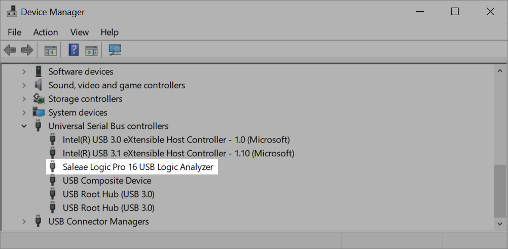

# PC Detection Test

In cases where the software cannot detect the logic analyzer, we need to determine if the PC itself can detect the Logic device:

1\. Before connecting Logic to the PC, ensure the Saleae Software is **not running**.

2\. Connect the device to the PC using the provided USB cable.

3\. Check if the operating system (OS) detects the device. The steps for this will depend on your operating system.

* **Windows:** \
  Open Device Manager. Expand the section "Universal Serial Bus controllers" and check for "Saleae Logic X USB Logic Analyzer" where "X" is the specific product version (4, 8, Pro 8, Pro 16, etc.). If "unidentified device" or "Westbridge" appears, then there is a problem with the Saleae driver. In these cases, please follow the instructions in the support article below to re-install your Saleae driver.


[driver-install.md](../logic-software/driver-install.md)


* **MacOS:** \
  Open "System Report" by opening the Apple menu and selecting "About this Mac," and then select "System Report." Afterwards, select USB under Hardware and check for "Westbridge" in the treeview.

.png>)

.png>)

* **Linux (Ubuntu):** \
  Run `lsusb` from the command line. Check for any device name containing "Saleae" or a VID and PID that matches one of our Logic products. You can refer to the VID/PIDs of our devices in the support article below for reference.


[the-devices-usb-vid-and-pid-failed.md](the-devices-usb-vid-and-pid-failed.md)


4\. If the PC detects the Logic device properly, open the Logic software. If the Logic software still does not detect your device, then the hardware is likely OK and this may be a software issue. Proceed to _Part 2: Troubleshooting the Connection to the Software_, found in the support article linked below.


[logic-not-detected.md](logic-not-detected.md)


