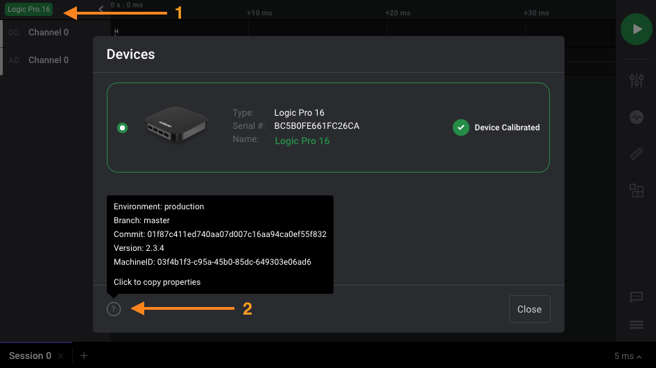

# Sharing your Machine ID

In some cases, our support team may request for your machine ID to investigate bugs on the [Logic v2 software](https://ideas.saleae.com/f/changelog/).

To find your machine ID:

1. Click on your logic analyzer at the top-left. 
2. In the _Devices_ pop-up window, click the question mark icon at the bottom left to copy it into your clipboard.
3. Afterwards, you can paste the text when our support team asks for it.

