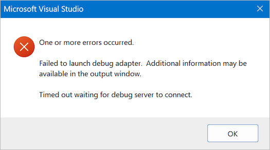

# Visual Studio Error: Failed to Launch Debug Adapter

When debugging a custom low level analyzer, and when attempting to attach a debugger to the Logic 2 software via the [instructions here](https://github.com/saleae/SampleAnalyzer/blob/master/readme.md#debugging), the following Microsoft Visual Studio error pop-up may appear.

<figure><figcaption>
Failed to launch debug adapter error message
</figcaption></figure>

The solution for this is to ensure you follow the debugging instructions linked above. Specifically, "Native code" needs to be selected in the Debug menu in Visual Studio.
