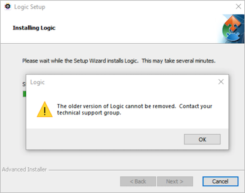
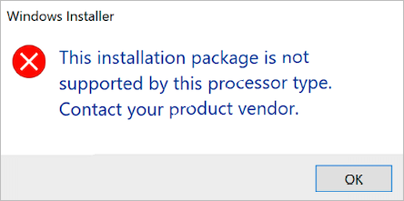

# Installation Errors

### The Older Version of Logic Cannot be Removed

The error message upon installation is likely caused by a missing or mis-referenced uninstaller file location. Unfortunately, we're unsure of what exactly causes this error, however we've detailed a solution below.

<figure><figcaption><p>The Older Version of Logic Cannot be Removed</p></figcaption></figure>

Specifically, Microsoft has made available an [Install and Uninstall troubleshooter](https://support.microsoft.com/en-us/topic/fix-problems-that-block-programs-from-being-installed-or-removed-cca7d1b6-65a9-3d98-426b-e9f927e1eb4d) which might help. The troubleshooter should provide steps for you to follow, and you'll want to locate the our software from the list of available software to uninstall. Once you've uninstalled it via this method, you may attempt to re-install the latest version of our Logic software.

### The Logic Setup Wizard Ended Prematurely

In case you run into the issue below, please try installing the software the command line argument described below to generate a log file (replacing the "x"s with the particular version you are installing).&#x20;

.png>)

For example, if your installer is located inside of your Downloads folder, you can run the following commands in Command Prompt.

```
cd C:\Users\Username\Downloads
"Logic Setup 2.x.xx-master.exe" /L*V installog.txt
```

Afterwards, [contact us](https://contact.saleae.com/hc/en-us/requests/new) and attach your `installog.txt` file (it will be generated in the same location as your installer) and we can take a look at what could be causing the install error.

### Windows Driver Signature Validation Issue

When reviewing user submitted installog.txt files, a common error we see is the following:

`ERROR: InstallDriverPackages failed with error 0xE0000242`

This is typically solved by performing a Windows Update.

### Manually Installing your Saleae Drivers

Some users have reported that installing the Saleae drivers manually via the methods listed in the support article below solves various install issues.


[driver-install.md](../logic-software/driver-install.md)


### Known Issues with Windows 11 Insider Preview Builds

Installation issues on Windows 11 are typically caused when you are running on an Insider Preview build of Windows 11. We're currently tracking issue reports of this in the [bug report here](https://ideas.saleae.com/b/feature-requests/issues-on-windows-11/).

Based on user reports, we believe there may be issues with Windows 11 Insider Preview buils that prevent our driver's signature from being validated, similar to the Windows issue we share above. We haven't figured out why this happens exactly, but the following workarounds might solve this for you.

#### Solutions

* Opting out of the Insider Preview build and reverting back to a normal, stable build of Windows 11 seems to have solved this issue for most users. Microsoft has provided instructions on how to leave their Insider program [here](https://insider.windows.com/en-us/leave-program). As of the writing on this support article section, it doesn't look like there is an immediate method for unenrolling your PC from an Insider Preview build besides completing a clean installation of Windows.
* Another user seems to have solved this issue by starting Windows with the option to load unsigned drivers. You can refer to their [forum post here](https://discuss.saleae.com/t/logic-2-3-37-failed-to-install-on-windows-11/1191/12).

### Reaching out to your IT Deparment

For PCs managed by an IT deparment, either through a corporate network or corporate security plan, you may need to reach out to them for further assistance. We've discovered in the past that some installation issues had been solved by modifying an IT policy, particularly ones that affect what root certificates are trusted on the PC.

We would be happy to chat with them directly as well! In this case, feel free to have them [contact us](https://contact.saleae.com/hc/en-us/requests/new).&#x20;

### This Installation Package is Not Supported by this Processor Type

<figure><figcaption><p>Installation error on 32-bit Operating Systems</p></figcaption></figure>

This error message during installation typically occurs when attempting to install the Logic 2 software on a 32-bit processor or operating system. Please note that 32-bit operating systems are not supported by Logic 2.x. For 32-bit support, please refer to Logic 1.x below.


[older-software-releases.md](../logic-software/legacy-software/older-software-releases.md)



## Logic 1.x Software

If you plan on using the older Logic 1.x software, the following information applies.

Below is a list of all known reasons and corresponding solutions or next steps that can cause this particular issue. Please check each one, skipping any items that are not relevant (such as issues specific to an operating system you are not using).

For each item, first perform the test. If the test result is positive (the test condition was met), then attempt the corrective action.

### **Old Software**

* Test: Make sure the version of Logic you have downloaded and installed is the [latest version](https://www.saleae.com/downloads).
* Corrective Action: Download the latest version for your operating system.

### **Proper OS Used**

* Test: Are you using an unsupported operating system?
* Corrective Action: Use a supported operating system.


[supported-operating-systems.md](../logic-software/supported-operating-systems.md)


### **Wrong Installer Downloaded**

* Test: Verify that you downloaded the correct installer for your operating system. Note that on Linux, you must download the correct variant (32 bit or 64 bit).
* Corrective Action: Download the correct version.

### **Anti-Virus False Positive**

* Test: Does your anti-virus detect the logic software or installer as a virus and prevent you from running it?
*   Corrective Action: First, verify that this is actually a false positive and not an actual issue. Make sure you downloaded the Logic software directly from the [saleae website](https://www.saleae.com/downloads).&#x20;

    &#x20; You can also test the download against other anti-virus programs using the online service [Virus Total](https://www.virustotal.com/).

    &#x20; If this is just a false positive, you can either manually ignore the file if your anti-virus allows it, or you can disable your anti-virus.&#x20;

    &#x20; We typically see false positives with AVG. You can find the [1.2.2 virus total results here](https://www.virustotal.com/en/file/9b9fc726f45a206a52aef9695d309bc0ee7ce583e4c06577f0b4875fe81207ee/analysis/1435262948/).

### **Logic Software Installer Fails with Error on Windows**

* Test: Attempt to install the Logic software using the downloaded installer for your platform.
*   Corrective Action: Try using the "standalone" version of the software. The download link can be found below the normal installer downloads.

    &#x20; The "standalone" version of the software does not need to be installed. Simply extract it and run Logic.exe.

    &#x20; Please note that the installer normally handles driver installation. You may need to manually install the driver if you use the standalone version. The driver files are included with the standalone download.

    &#x20; You can find all the download links for the latest beta, including the standalone releases below.


[older-software-releases.md](../logic-software/legacy-software/older-software-releases.md)


### **The Saleae Drivers Are Preventing the Software from Installing**

* Test: Attempt to install the Logic software. If the installation fails with an error message related to the driver installation, that indicates a driver-related problem.
* Corrective Action: Download the standalone version of the software as described above. Then attempt a manual driver install using the new hardware/update driver wizard.
* If the same error persists during the manual driver install, please check the driver install help found below.


[driver-install.md](../logic-software/driver-install.md)


### **The Software Will Not Launch (All Platforms)**

* Test: When trying to run the software, nothing happens. The software does not appear. No error message is displayed.
* Corrective Action: Try deleting the settings file called settings.xml, which may have become corrupt.


Before you can find and delete settings.xml...

* On Windows - Showing hidden files and folders should be enabled. [Instructions Here](https://support.microsoft.com/en-us/help/14201/windows-show-hidden-files)
* On OSX - Showing the Library folder should be enabled. [Instructions Here](https://discussions.apple.com/thread/8137224?answerId=8137224021#8137224021)


*   It can be located here:\
    On Vista/7/8/10:

    > C:\Users\YourUserName\AppData\Roaming\Saleae LLC\Logic\settings.xml

    On XP:

    > C:\Documents and Settings\YourUserName\Application Data\Saleae LLC\Logic\settings.xml

    On OSX:

    > /Users/YourUserName/Library/Preferences/Saleae/settings.xml

    On Linux:

    > Inside the folder with the Logic executable in the Settings folder.
