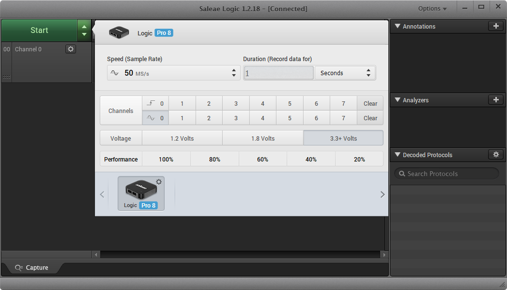
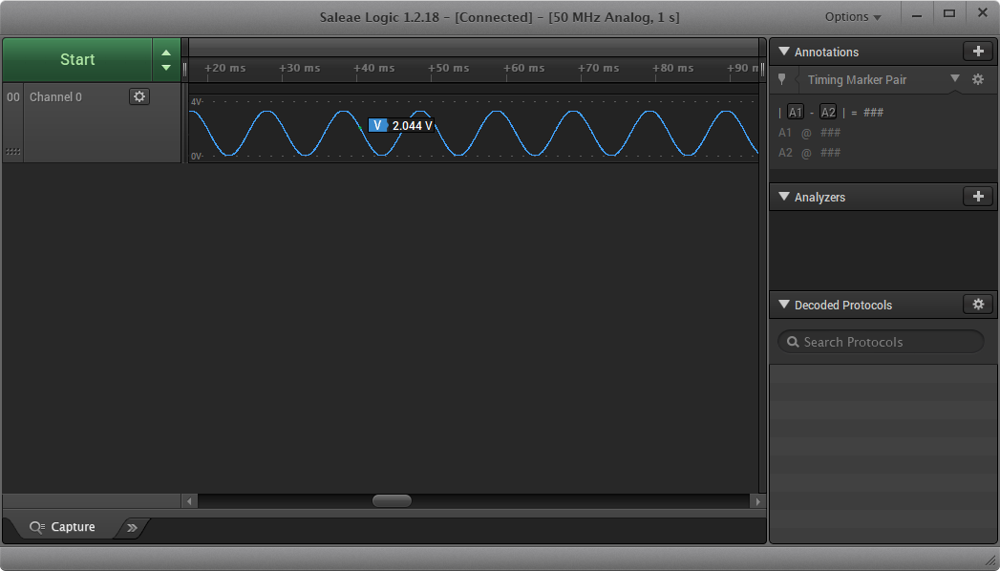
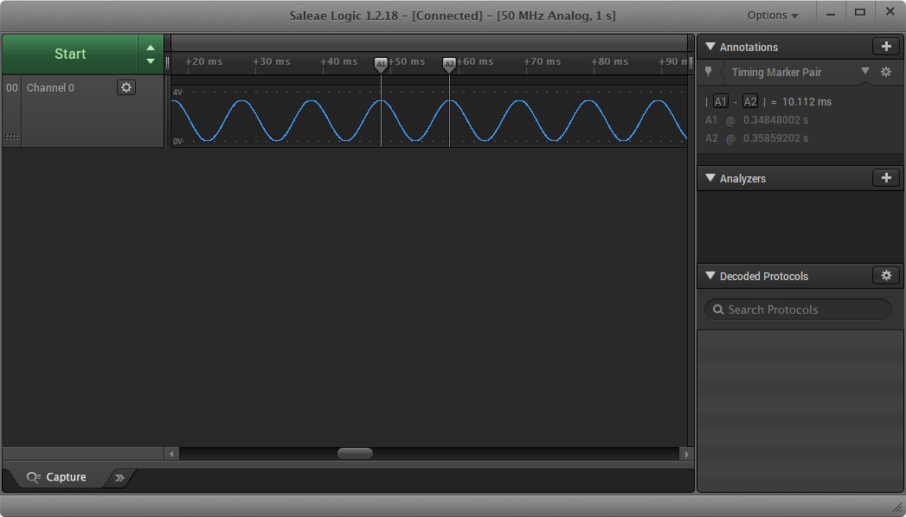

# How to Measure Analog Signals

## How to Measure Analog Signals

One useful feature of your Saleae Logic Analyzer is its ability to measure analog signals \(from 0 to 5 V\). As such, it can function as an oscilloscope with up to 8 channels \(for the Logic 8 and Logic Pro 8\) or 16 channels \(for the Logic Pro 16\).

Depending on the number of channels you use, the Logic 8 can sample up to 10 MS/s \(bandwidth of 1 MHz\). The Logic Pro 8 and Logic Pro 16 can sample up to 50 MS/s \(bandwidth of 5 MHz\).

Example code is provided below for [Arduino](https://www.arduino.cc/), [mbed](https://os.mbed.com/), or [AC6 System Workbench for STM32 \(SW4STM32\)](http://www.openstm32.org/).

**Required Materials**

| Item |
| :--- |
| One of the Saleae logic analyzers: [Saleae Logic 8](https://usd.saleae.com/products/saleae-logic-8), [Saleae Logic Pro 8](https://usd.saleae.com/products/saleae-logic-pro-8), or [Saleae Logic Pro 16](https://usd.saleae.com/products/saleae-logic-pro-16)​ |
| ​[Nucleo-F446RE](https://www.digikey.com/product-detail/en/stmicroelectronics/NUCLEO-F446RE/497-15882-ND/5347712)​ |

#### Connect Hardware 

For this example, you will only need 1 harness plugged into your Logic Analyzer. We will be using channel 0. 

Connect the channel 0 and GND wires to the Nucleo board as shown below. Note that pin PA\_4 \(A2 on the Arduino headers\) is DAC\_OUT1 \(digital-to-analog converter output 1\) on the Nucleo-F446RE.

#### Run Demo Application 

Download the example code for your IDE:







Open the demo in your chosen IDE. Compile the program, and upload it to the Nucleo-F446RE development board. Whenever the board has power, it should begin running the analog example program, which produces a sinewave pattern on pin PA\_4 \(Arduino pin A2\).

#### Measure the Signal 

Open the Logic software with the Logic Analyzer plugged in. Click on the **Device Settings Button**.

In the device settings window, set the speed to **at least 50 MS/s** and the duration to **1 second**. Click both **Clear** buttons to disable all channels, leaving only the digital channel 0 enabled. Click the **analog Channel 0** to enable it, and click the **digital Channel 0** to disable it.

Click the **Device Settings Button** again to close the configuration window. Click **Start** to begin collecting data. After a moment, you should see a sinewave appear in the main window. Note that you might have to zoom out. If you hover your mouse over the sinewave, you should see the measured voltage at that time pop up.

If you would like to measure the time between two points on the signal, you can select the A1 and A2 markers underneath the _Timing Marker Pair_ tab on the right side. Click the **A1** button, which will put a marker on your cursor. Click on a peak in the waveform. Click on **A2**, which will put another marker on your cursor. Find an adjacent peak to place the second marker. You should see the time difference between those points appear next to the A1 and A2 buttons.

As you can see, the period is measured to be about 10 ms, which is close to the 100 Hz we set in the demo programs.

