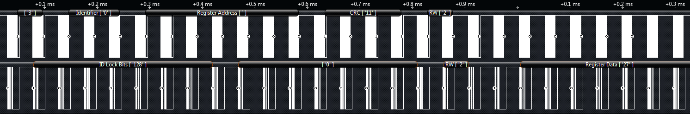

# BiSS C

The BiSS C protocol is typically used for the collection of sensor data and the control of actuators, such as in-machine automation and robotics.

**Top Resources**

* [BiSS Saleae Analyzer Guide](http://biss-interface.com/download/biss-an-18/)
* [Wikipedia](http://en.wikipedia.org/wiki/BiSS_interface)
* [BiSS Protocol Description](http://biss-interface.com/download/biss-c-protocol-description-english/)

**Example BiSS C Parts**

* [Ethernet Counter System](http://addi-data.com/msx-e1701-msx-e1711-msx-e1721-4-counter-inputs-incremental-sincos-16-digital-io-24-v/)
* [Motion Controller](http://addi-data.com/motion-control-for-servo-or-stepper-motors/)
* [Counter Board](http://addi-data.com/fast-counter-inputs-programmable-functions-for-pci-express/)
* [Digital Servo Amplifiers](http://www.aerotech.com/media/322011/ndrive%20pwm.pdf)

**What Logic Decodes**

<figure><figcaption></figcaption></figure>

* Clock MA Sync
* Slave Ack
* Start Bit
* Sensor Data
* Actuator Data
* Timeout (Stop)
