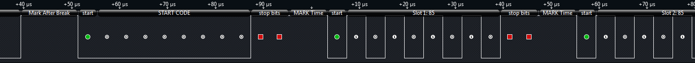

# Digital MultipleX (DMX512)

## Digital MultipleX (DMX512)

DMX512 (Digital MultipleX) is a protocol used to control lighting and special effects. A DMX512 network contains a single DMX512 controller and one or more slave devices.

**Top Resources**

* [Wikipedia](http://en.wikipedia.org/wiki/DMX512)
* [DMX512 Fundamentals (Lutron)](http://www.lutron.com/en-US/Education-Training/Documents/DMX%20webinar_7-29-2010.pdf)
* [DMX 101 Handbook (PDF)](http://www.elationlighting.com/dmx-101-hand-book)

**Example DMX512 Parts**

* [DMX Lighting Controller](http://www.musiciansfriend.com/pro-audio/chauvet-obey-70-dmx-lighting-controller)
* [Nicolaudie SUITE2\_BC DMX512 Controller](http://www.nicolaudie.com/en/suite2bc.htm)

**What Logic Decodes**

<figure><figcaption></figcaption></figure>

* Break Condition
* Mark-After-Break
* Start Bit
* Data Byte (Slots)
* Stop Bites (2)
