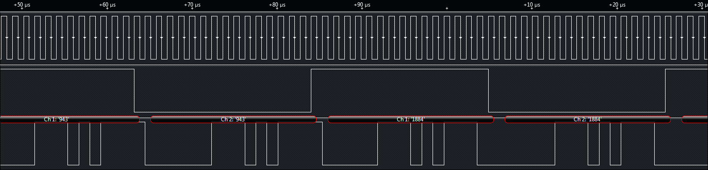

# Learn I2S / PCM

I2S is a synchronous serial bus used for digital audio. It typically consists of a data, clock, and word select line.

**Top Resources**

* [Wikipedia](http://en.wikipedia.org/wiki/I%C2%B2S)
* [SparkFun I2S Spec](https://www.sparkfun.com/datasheets/BreakoutBoards/I2SBUS.pdf)
* [I2S to MSP430 Tutorial](http://www.ti.com/lit/an/slaa449a/slaa449a.pdf)

**Example I2S / PCM Parts**

* [Stereo ADC](https://www.sparkfun.com/products/9365)
* [MP3 and MIDI Codec](https://www.sparkfun.com/products/11025)
* [Teensy 3.0](https://www.sparkfun.com/products/11780)
* [AM/FM Radio IC](https://www.sparkfun.com/products/11737)

**What Logic Decodes**

<figure><figcaption></figcaption></figure>

* Serial Clock
* World Select Line (WS)
* Serial Data Line (SD)
* Left and right audio
