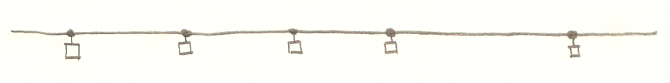
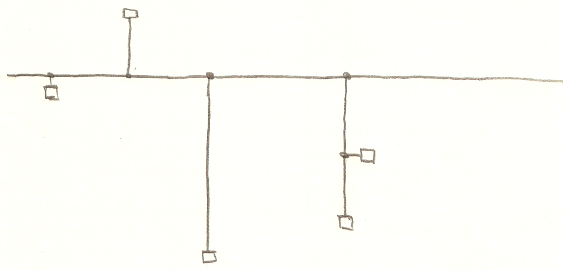
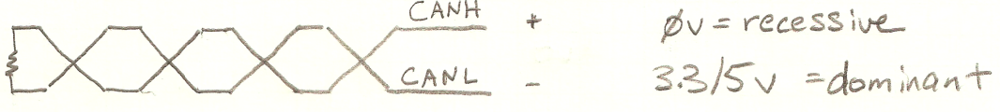
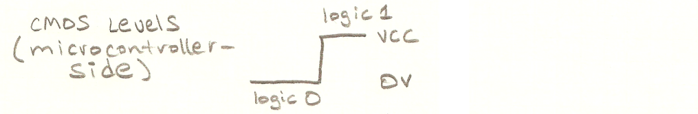
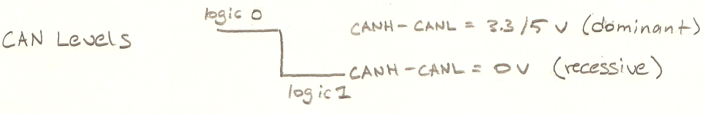
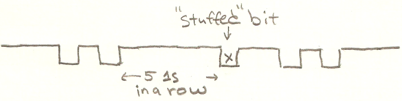
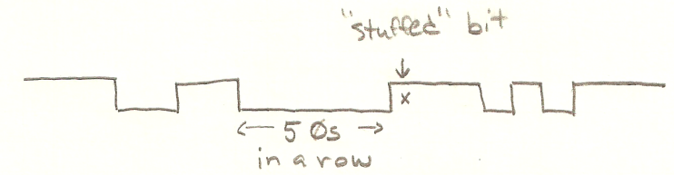
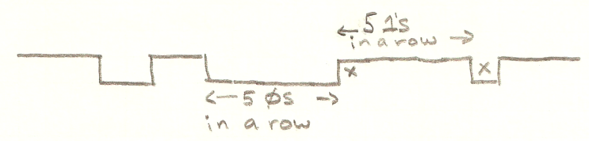
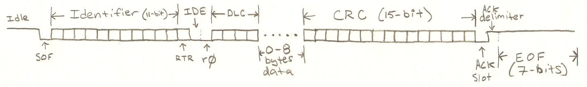
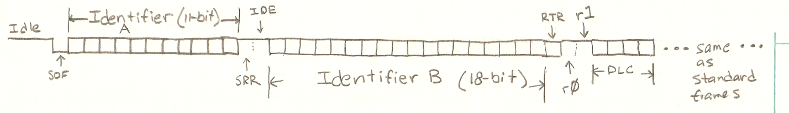

# Learn CAN – Controller Area Network

## Learn CAN – Controller Area Network

CAN (controller area network) is a differential serial bus typically used in automotive and industrial applications for sensor data collection and system control.

### **Topology**

The Controller Area Network is a bus that can connect many devices, called nodes. When a node sends data on the bus, it broadcasts it. It identifies itself, but not the recipient. Only one node may be transmitted on the bus at a time.

The CAN specification didn't originally define the physical layer, but since then, a standard has been adopted and is in wide use.

The CAN bus itself is a single long cable with CAN nodes connected very close to the cable. For instance, you wouldn't have any cables coming off the main cable, just very short "stubs" to connect to each device.

Yes:

<figure><figcaption></figcaption></figure>

No:

<figure><figcaption></figcaption></figure>

### **Electrical**

The cable consists of a single differential pair, typically twisted, with a characteristic impedance of 120 ohms. The far ends of the cable are terminated with 120-ohm resistors.

<figure><figcaption></figcaption></figure>

Typically, a ground wire is also provided. To prevent ground loops and reference voltage differences, it should be the only ground reference used. Some CAN transceivers are isolated to get around this limitation. Power is also commonly provided. A connector is not part of the physical layer specification, but the DB9 connector is common.

### **Electrical States**

There are two electrical states—recessive and dominant.

**Recessive**

In the recessive state, no node (CAN device) drives the bus. Since both ends of the long cable are terminated (120ohm resistors across each end), the voltage across the differential pair quickly falls to zero.

**Dominant**

In the dominant state, one end of the differential pair, called CANL, is pulled low, while the other end, CANH, is pulled high (generally 5V or 3.3V). Naturally, that overrides the recessive state, and thus the name.

<figure><figcaption></figcaption></figure>

### **Similarity to Single-Ended, Pulled-Up Bus**

This situation is somewhat analogous to a single wire bus where the bus is pulled up with a resistor (recessive) or pulled down by a device (dominant). Its purpose is to provide access to a shared medium in such a way that multiple devices with conflicting bit states will not short each other.

### **CAN Transceivers**

Since the CAN bus is a differential pair, typically a CAN transceiver is employed between a microcontroller (FPGA, ASIC, etc.) and the CAN bus.

On the microcontroller side, there are typically two connections: an input and an output. The output always reports the state of the CAN bus—0 for dominant, 1 for recessive.

The CAN transceiver's input is how you tell the transceiver to actually talk on the bus. A 0 will cause the transceiver to assert a dominant state on the bus, and a 1 will cause a recessive state.

### **Logic States**

The recessive state on the can bus is where the voltage across the differential pair (CANH - CANL = 0V) is 0. This corresponds to the logic 1 state.

The dominant state on the CAN bus is there where there is voltage (5 or 3.3V) across the differential pair (CANH - CANL = 3.3/5 V). That corresponds to the logic 0 state.

Notice that once you are on the microcontroller side, the IO voltages do match the logical states (positive logic). In other words, on the microcontroller side, 0V is logic 0, and 5/3.3V is logic 1. It looks very similar to the CMOS-level serial since the idle state is 1.

<figure><figcaption></figcaption></figure>

<figure><figcaption></figcaption></figure>

### **Bits on the Bus**

Bits are put on the bus in the same manner as RS-232 style asynchronous serial—each bit has a certain time on the bus before the next one's turn. The bit rate can vary, but 1Mbit is common (1µs per bit).

**Idle**

When no nodes are transmitting, the bus is idle. That is the recessive state.

A transmission starts when a node asserts a dominant state on the bus. The first bit is the SOF (start of frame) bit and is analogous to the start bit in RS-232 style serial. Additional bits follow. We'll talk about the structure of this data a little further down.

**Asynchronous Serial and Timing Drift**

Whenever a bit changes—from 0 to 1, or from 1 to 0—there is an opportunity for a receiver to resynchronize—to clear out any timing error that has built up between the transmitter and the receiver. However, the longer the time period between transitions, the more timing error can build up. If many 0s (or 1s) are sent in succession, a timing error could easily exceed the design margins. RS-232 style serial solves this problem by forcing transitions between bytes (the start and stop bits). CAN resolves the problem by using "bit stuffing."

**Bit Stuffing**

Bit stuffing is a method to make sure there are never any more than a specified number of bits that are exactly the same in a row. In other words, it forces a minimum number of transitions in a data stream so the receiver can be guaranteed a worst-case resynchronization gap.

If 5 zeros are sent in a row, CAN requires that a 1 be sent next. That extra bit will be thrown away by the receiver.

If 5 ones are sent in a row, CAN requires that a 0 be sent next. That extra bit will be thrown away by the receiver.

<figure><figcaption></figcaption></figure>

Remember that even if the next bit in the data would cause the needed transition, the receiver won't know that. You must insert the extra bit.

<figure><figcaption></figcaption></figure>

There is one gotcha worth mentioning. 0 0 0 0 0 will be followed by a stuffed 1. Let's say another 4 1s then follow. Does that count as 5 ones or 4? It counts as 5—so yes, we would then stuff a 0. Remember that the point is to limit the time you can go without seeing a transition.

<figure><figcaption></figcaption></figure>

If a receiver received 6 consecutive bits in a row, that is considered an error, and it throws away any subsequent data.

**CAN Frames**

Everything in CAN is sent in a frame (or message). This is essentially a packet. It consists of the sender's unique ID, some flags, some data, and a CRC.

**Standard and Extended Frames**

There are two versions of the CAN frame—CAN 2.0 A and CAN 2.0C B. CAN 2.0 A uses 11-bit identifiers (standard frame), and CAN 2.0 B uses a 29-bit identifier (extended frame).

The identifier of a given node must be unique on the bus.

**DATA and REMOTE Frames**

A DATA frame's identifier is that of the sender (transmitter). The frame can contain up to 8 bytes of data.

A REMOTE frame's identifier is that of another device—a device that the sender is requesting data from. REMOTE frames do not contain any data bytes.

A single bit, the RTR (remote transmission request) bit determines if a frame is DATA or REMOTE.

**Standard (11-Bit ID) Frames**

<figure><figcaption></figcaption></figure>

**SOF Bit**

The CAN DATA frame starts with the SOF (start of frame) bit. That is analogous to the start bit in the RS-232 style asynchronous serial. It is the bit required to transition from idle to non-idle. The SOF bit is a logic 0 (dominant).

**Identifier Field (11 Bits)**

The identifier is the ID of the sender. Every CAN node must have a unique identifier.

**RTR Bit**

RTR (remote transmission request) is a single bit that indicates if this is a DATA frame (0, dominant) or a REMOTE frame (1, recessive).

**IDE Bit**

The IDE (identifier extension bit) must be 0 (dominant) for 11-bit identifiers.

**r0 Bit**

The r0 (reserved bit 0) must be set to 0 (dominant) by senders but ignored by receivers.

**DLC Field (4 Bits)**

The DLC (data length code) field indicates how many bytes of data this frame will contain (0–8).

**Data Field (0–8 bytes)**

This is the data the DLC field told us to expect.

**CRC Field (15 Bits)**

This 15-bit CRC is used to check for any errors in the received data.

**ACK Slot**

This single bit space is an opportunity for any receiver(s) to provide an acknowledgment. The sender sets the recessive state, and any number of receivers may overwrite it with a dominant state.

**ACK Delimiter**

This single bit is always a 1 (recessive).

**END of Frame (7 Bits)**

The END of frame is simply a sequence of 7 recessive bits. This provides padding so that a recently attached device can tell that the frame has ended. Recall that 6 or more sequential bits of the same state is an error. The END of Frame is a deliberate error that acts as a frame synchronization event. Note that the END of Frame is not bit-stuffed since that would defeat its purpose.

**Extended (29-Bit ID) Frames**

<figure><figcaption></figcaption></figure>

**SOF Bit**

The frame starts with the start of frame (SOF) bit. That is the same as in standard frames.

**Identifier A (11 Bits)**

This is the first 11 bits of the 29-bit extended frame identifier.

**SRR Bit**

SRR (substitute remote request) is always a 1 (recessive) in extended frames.

**IDE Bit**

The IDE (identifier extension bit) must be 1 (recessive) in extended frames.

**Identifier B (18 Bits)**

The next 18 bits of the 29-bit extended frame identifier.

**RTR Bit**

The RTR (remote transmission request) bit is 0 (dominant) if this is a DATA frame, or 1 (recessive) if this is a REMOTE frame.

**r0, r1 Bits**

r0 and r1 are reserved bits. Senders must send 0s (dominant), and receivers must accept any state.

**DLC Field (4 Bits)**

The DLC (data length code) is the same as in standard frames.

**Data Field (0–8 Bytes)**

This is the data the DLC field told us to expect. It is the same as in standard frames.

**CRC Field (15 Bits)**

This 15-bit CRC is used to check for any errors in the received data. It is the same as in standard frames.

**ACK Slot**

This single bit space is an opportunity for any receiver(s) to provide an acknowledgment. This is the same as in standard frames.

**ACK Delimiter**

This single bit is always a 1 (recessive). It is the same as in standard frames.

**END of Frame (7 Bits)**

The END of Frame is simply a sequence of 7 recessive bits. This is the same as in standard frames.

**Arbitration**

CAN nodes listen to the bus and will only attempt to transmit frames if the bus is idle. As soon as the bus becomes idle, however, multiple nodes may attempt transmission simultaneously.

Since dominant (0) wins out over recessive (1) on the CAN bus, an individual node can check to see if its recessive bits are, indeed, recessive. As long as they are, then it may continue transmitting.

If a node detects a dominant (0) bit when it has attempted to send a recessive (1) bit, it stops transmitting and yields to the other node(s) until idle.

Note that that the frame identifier is thus related to the priority of the frame. Frame identifiers will be chosen so high-priority devices will win arbitration over lower-priority ones.

**References**

| [Wikipedia](http://en.wikipedia.org/wiki/Controller_area_network) | [Texas Instruments](http://focus.ti.com/lit/an/slla270/slla270.pdf) | [BOSCH CAN Specification 2.0](http://esd.cs.ucr.edu/webres/can20.pdf) |
| ----------------------------------------------------------------- | ------------------------------------------------------------------- | --------------------------------------------------------------------- |

**Example CAN Devices**

| [Microchip MCP2515 stand-alone CAN Controller](http://ww1.microchip.com/downloads/en/DeviceDoc/21801F.pdf) | [Microchip PIC18F66K80 Microcontroller Family with CAN](http://ww1.microchip.com/downloads/en/DeviceDoc/39977c.pdf) | [TI SN65HVF230 3.3V CAN Transceiver](http://focus.ti.com/lit/ds/symlink/sn65hvd230.pdf) |
| ---------------------------------------------------------------------------------------------------------- | ------------------------------------------------------------------------------------------------------------------- | --------------------------------------------------------------------------------------- |

### Further Reading

**Top Resources**

* [Wikipedia](http://en.wikipedia.org/wiki/Controller_area_network)
* [Bosch CAN Specification 2.0](http://esd.cs.ucr.edu/webres/can20.pdf)

**Example CAN Parts**

* [Stand-alone CAN Controller](http://ww1.microchip.com/downloads/en/DeviceDoc/21801F.pdf)
* [PIC18F66K80 with CAN](http://ww1.microchip.com/downloads/en/DeviceDoc/39977c.pdf)
* [TI 3.3V CAN Transceiver](http://focus.ti.com/lit/ds/symlink/sn65hvd230.pdf)

**What Logic Decodes**

* Start Bit
* Identifier (Arbitration Frame)
* Extended Frames
* Control Frame
* Data Bytes
* CRC
* ACK/NAKs
* Stop Bit
* Stuffed Bits
