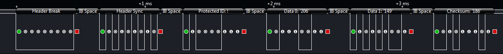

# Local Interconnect Network (LIN)

LIN (Local Interconnect Network) is used for communication between components in vehicles. Used to complement the existing CAN network, LIN is an inexpensive alternative for certain remote components.

**Top Resources**

* [Wikipedia](http://en.wikipedia.org/wiki/Local_Interconnect_Network)
* [LIN Fundamentals (.pdf)](http://ece.eng.wayne.edu/~smahmud/ECECourses/ECE5620/Notes/LIN_Protocol.pdf)
* [LIN Explained (YouTube)](http://www.youtube.com/watch?v=M1VI9wITmA4)
* [National Instruments](http://www.ni.com/white-paper/9733/en/)

**Example LIN Parts**

* [Microchip LIN Tranceivers](http://www.microchip.com/pagehandler/en-us/technology/lin/products/home.html)
* [Atmel LIN Tranceivers](http://www.atmel.com/products/automotive/lin/lin_networking.aspx)
* [LIN Keypad](http://www.glyn.com/data/glyn/media/doc/hal2810_2pi.pdf)

**What Logic Decodes**

<figure><figcaption></figcaption></figure>

* Break
* Sync
* ID
* Data Bytes
* Checksum
